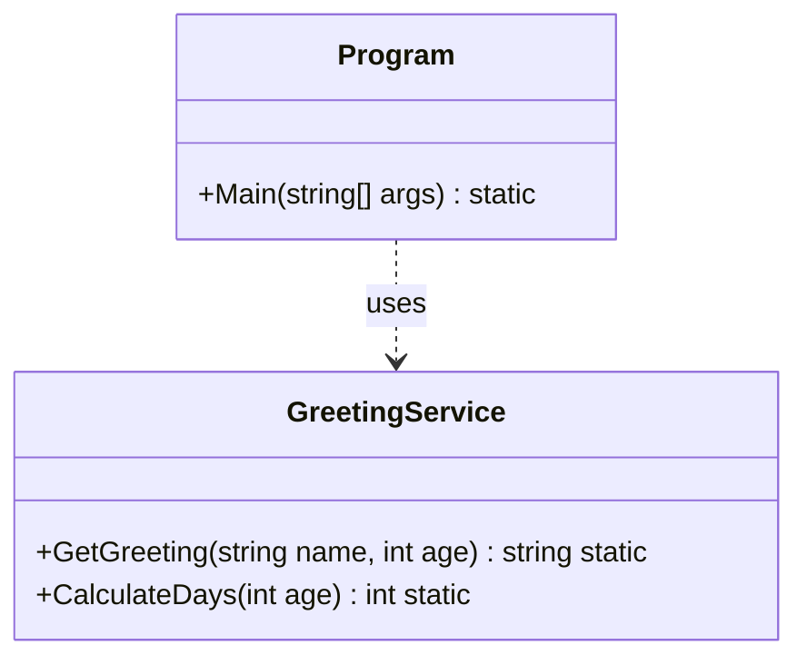

# 01 - Einführung & Console I/O

## 💡 Theorie
In dieser ersten Einheit wiederholen wir die absoluten Grundlagen der C#-Entwicklung.
- **Top-Level Statements** vs. **Klassische Struktur** (`Program.Main`).
- **Console Input/Output**: Interaktion mit dem Benutzer.
- **Datentypen**: Parsen von Strings zu Integern.
- **Compiler**: Wie aus Code eine ausführbare Datei wird.

### Wichtige Befehle
```csharp
Console.WriteLine("Hallo Welt"); // Ausgabe mit Zeilenumbruch
string input = Console.ReadLine(); // Eingabe lesen
int number = int.Parse(input);     // Konvertierung
```

## 📝 Aufgabenstellung
Schreiben Sie eine Konsolenanwendung `GreetingApp`, die:
1.  Den Benutzer nach seinem **Namen** fragt.
2.  Den Benutzer nach seinem **Alter** fragt.
3.  Das Alter in **Tagen** umrechnet (Grob `Alter * 365`).
4.  Eine begrrüßung mit Namen und dem berechneten Alter in Tagen ausgibt.
5.  Die Anwendung soll sauber fehlerhafte Eingaben (keine Zahl) abfangen (Try-Catch oder TryParse).

*Ziel: Ein robustes "Hello World" nach Industrienorm.*

## 🧩 UML Klassendiagramm
Obwohl wir hier nur eine statische Klasse nutzen, visualisieren wir die Struktur.



## ✅ Definition of Done
- [ ] Projekt kompiliert ohne Warnungen.
- [ ] User Input wird validiert.
- [ ] XML Dokumentation ist vollständig.
- [ ] Unit Tests für die Berechnung sind grün.
