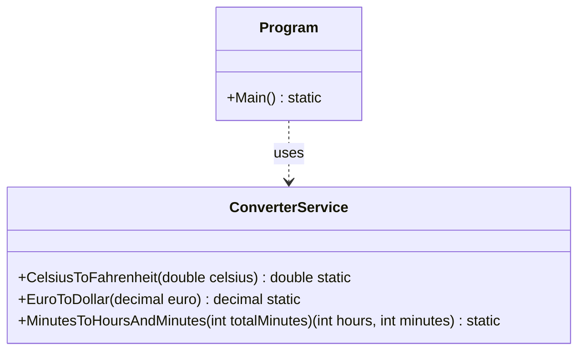

# 02 - Grundlagen der Datentypen

## 💡 Theorie
In dieser Einheit behandeln wir die fundamentalen Bausteine von C#.
- **Wertetypen**: `int`, `double`, `bool`, `char`.
- **Präzision**: Warum wir für Geld `decimal` und nicht `double` verwenden.
- **Casting**: Implizite vs. Explizite Typumwandlung.
- **Operatoren**: Arithmetik (`+`, `-`, `*`, `/`, `%`) und Zuweisung.

### Wichtige Konzepte
```csharp
int ganzzahl = 42;
double gleitkomma = 42.5; 
decimal geld = 42.99m; // 'm' Suffix für Decimal
bool istWahr = true;

// Division Caveat
int a = 5;
int b = 2;
Console.WriteLine(a / b); // Ausgabe: 2 (Ganzzahldivision!)
Console.WriteLine((double)a / b); // Ausgabe: 2.5
```

## 📝 Aufgabenstellung
Erstellen Sie eine Konsolenanwendung `ConverterApp`, die als Multifunktions-Rechner dient.
Das Programm soll folgende Konvertierungen durchführen:

1.  **Temperatur**:
    - Eingabe: Temperatur in Celsius (z.B. 25,5).
    - Ausgabe: Temperatur in Fahrenheit (`Celsius * 9/5 + 32`).
2.  **Währung**:
    - Eingabe: Betrag in Euro.
    - Ausgabe: Betrag in US-Dollar (Kurs: 1.10).
    - *Wichtig*: Verwenden Sie `decimal` für Währungen!
3.  **Zeit-Rechner (Modulo)**:
    - Eingabe: Eine Anzahl von Minuten (z.B. 150).
    - Ausgabe: Umrechnung in Stunden und Minuten (z.B. "2 Stunden und 30 Minuten").

## 🧩 UML Klassendiagramm



## ✅ Definition of Done
- [ ] Korrekte Verwendung von `double` vs `decimal`.
- [ ] Modulo-Operator für Minuten-Berechnung genutzt.
- [ ] Unit Tests für alle Konvertierungen.
- [ ] XML Dokumentation vollständig.
