# 03 - Kontrollstrukturen

## 💡 Theorie
Code läuft nicht immer nur von oben nach unten. Wir brauchen Entscheidungen und Wiederholungen.
- **Verzweigungen**: `if`, `else`, `else if`.
- **Switch Expressions**: Das moderne `switch` in C#.
- **Schleifen**: `while`, `do-while`, `for`, `foreach`.

### Modernes Switch (Pattern Matching)
```csharp
string status = punkte switch
{
    >= 92 => "Sehr gut",
    >= 81 => "Gut",
    _ => "Andere Note"
};
```

## 📝 Aufgabenstellung
Entwickeln Sie einen **IHK-Notenrechner** (`GradeCalculator`).
1.  Der Benutzer gibt eine Punktzahl (0-100) ein.
2.  Das Programm ermittelt die Note gemäß IHK-Schlüssel:
    - 100-92: "Sehr gut"
    - 91-81: "Gut"
    - 80-67: "Befriedigend"
    - 66-50: "Ausreichend"
    - 49-30: "Mangelhaft"
    - 29-0: "Ungenügend"
3.  Verwenden Sie eine **Switch Expression**.
4.  Umgeben Sie die Logik mit einer **Do-While-Schleife**, damit der Benutzer mehrere Noten nacheinander berechnen kann, bis er "exit" eingibt.

## 🧩 UML Aktivitätsdiagramm

```mermaid
stateDiagram-v2
    [*] --> Start
    Start --> Eingabe: Punkte eingeben
    Eingabe --> Validierung: Prüfen (0-100)
    Validierung --> Berechnung: Switch Expression
    Berechnung --> Ausgabe: Note anzeigen
    Ausgabe --> Entscheidung: Weiter machen?
    Entscheidung --> Eingabe: Ja
    Entscheidung --> [*]: Nein
```



## ✅ Definition of Done
- [ ] Switch Expression korrekt implementiert.
- [ ] User Input Loop funktioniert.
- [ ] Fehleingaben (Buchstaben, >100) werden abgefangen.
- [ ] Unit Tests für die Noten-Grenzen.
