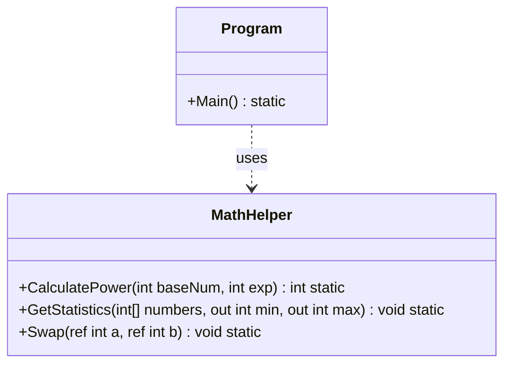

# 04 - Methoden

## 💡 Theorie
Methoden strukturieren Code in wiederverwendbare Blöcke.
- **Signatur**: Name + Parameter.
- **Rückgabetypen**: `void` vs. `int`, `string` etc.
- **Parameter-Modifizierer**: `ref`, `out`, `in`, `params`.
- **Benannte Argumente**: `Method(age: 25, name: "Max")`.

### Parameter-Typen
```csharp
// Call by Value (Standard): Kopie wird übergeben
void DoSomething(int x) { x = 10; } 

// Call by Reference: Original wird verändert
void DoSomethingRefs(ref int x) { x = 10; }

// Output: Muss zugewiesen werden
void GetValues(out int result) { result = 42; }
```

## 📝 Aufgabenstellung
Erstellen Sie eine `MethodPlayground` Anwendung mit einer `MathHelper` Klasse:
1.  **`CalculatePower(int baseNum, int exp)`**: Rekursive oder iterative Berechnung der Potenz.
2.  **`GetStatistics(int[] numbers, out int min, out int max)`**: Ermittelt Minimum und Maximum in einem Durchlauf und gibt sie per `out` zurück.
3.  **`Swap(ref int a, ref int b)`**: Tauscht zwei Zahlen per Referenz.
4.  Demonstrieren Sie alle Methoden im `Program.cs`.

## 🧩 UML Klassendiagramm



## ✅ Definition of Done
- [ ] `ref` und `out` korrekt implementiert.
- [ ] Unit Tests für `CalculatePower` und `GetStatistics`.
- [ ] XML Docs erklären den Unterschied zwischen `ref` und `out`.
