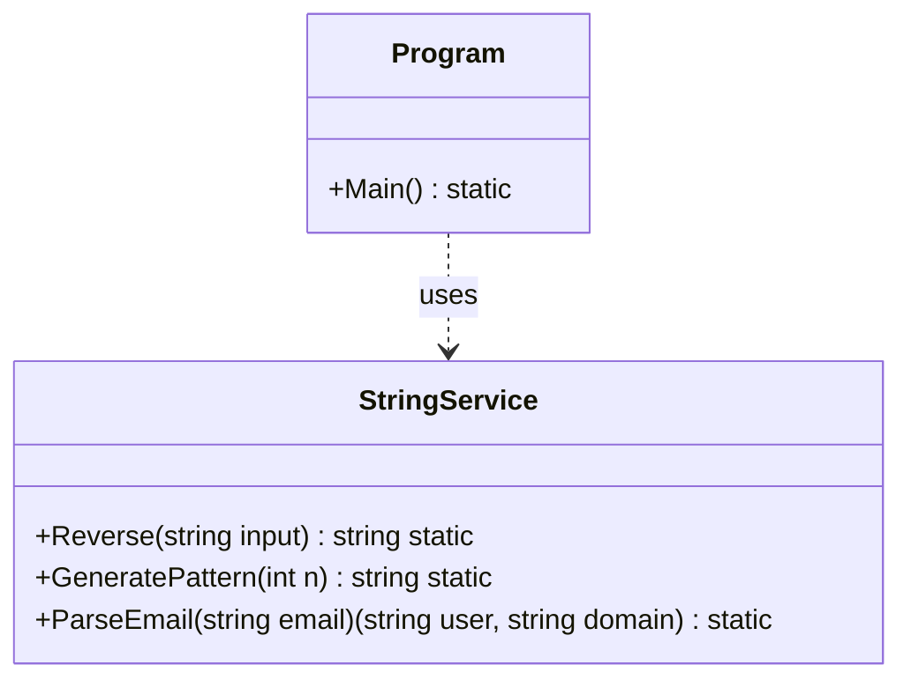

# 05 - Strings & Speicher

## 💡 Theorie
Strings sind in C# **immutable** (unveränderlich). Jede Änderung erzeugt einen neuen String im Speicher.
- **Heap vs Stack**: Wo landen Wertetypen? Wo Referenztypen?
- **StringBuilder**: Mutierbare Alternative für effiziente Textmanipulation.
- **Interpolation**: Modernes `$"Hello {name}"`.

### Performance-Falle
```csharp
// Schlecht (Erzeugt 1000 Strings)
string text = "";
for (int i = 0; i < 1000; i++) text += i;

// Gut (Nutzt internen Buffer)
var sb = new StringBuilder();
for (int i = 0; i < 1000; i++) sb.Append(i);
```

## 📝 Aufgabenstellung
Erstellen Sie den `StringExplorer` mit einer `StringService` Klasse:
1.  **`Reverse(string input)`**: Kehrt einen String manuell (mittels Array/Loop) um.
2.  **`GeneratePattern(int n)`**: Erzeugt ein Muster "1-2-3-...n" effizient mit `StringBuilder`.
3.  **`ParseEmail(string email)`**: Zerlegt eine E-Mail in User und Domain (nutzen Sie `Split` oder `Substring`).

## 🧩 UML Klassendiagramm



## ✅ Definition of Done
- [ ] StringBuilder für Schleifenoperationen genutzt.
- [ ] Tupel-Rückgabe bei `ParseEmail`.
- [ ] Unit Tests für Edge Cases (leere Strings, null).
