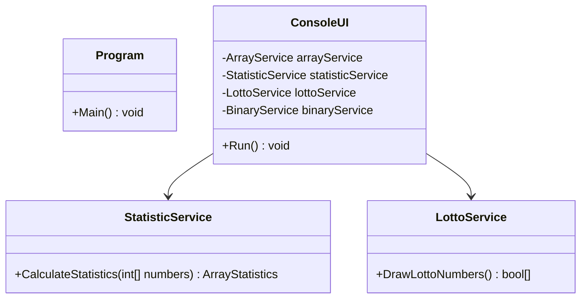

[⬅️ Zurück zum Hauptverzeichnis](../README.md)

# 06_Arrays: Arrays, Listen und Algorithmen

## 📚 Theorie: Arrays in C#

Ein **Array** ist wie ein Regal mit festen Fächern. Jedes Fach hat eine Nummer (Index) und kann einen Wert speichern.

### 1. Grundlagen
*   **Datentyp**: Alle Elemente müssen denselben Typ haben (z.B. nur `int` oder nur `string`).
*   **Feste Größe**: Einmal erstellt, kann die Größe eines Arrays nicht mehr geändert werden (anders als bei einer `List<T>`).
*   **0-Indiziert**: Das erste Element steht an Index `0`, das letzte an `Länge - 1`.

### 2. Syntax im Vergleich
```csharp
// 1. Klassische Erzeugung (C# 1.0+)
// Ein leeres Array für 5 Zahlen (Standardwert 0)
int[] zahlen = new int[5]; 

// 2. Direktinitialisierung (C# 3.0+)
// Größe wird automatisch ermittelt (hier 3)
string[] namen = new string[] { "Max", "Paul", "Lisa" };

// 3. Collection Expressions (C# 12 / .NET 8+)
// Die modernste und sauberste Schreibweise
int[] fibonacci = [1, 1, 2, 3, 5, 8];
```

### 3. Zugriff und Schleifen
Um Arrays zu durchlaufen, nutzen wir meist `for` oder `foreach`.

**Der Klassiker (for-Schleife):**
Perfekt, wenn man den Index `i` benötigt (z.B. um Werte zu ändern).
```csharp
for (int i = 0; i < zahlen.Length; i++)
{
    zahlen[i] = i * 2; // Werte ändern
}
```

**Die Moderne (foreach-Schleife):**
Besser, wenn man die Werte nur *lesen* will. Sicherer gegen Index-Fehler.
```csharp
foreach (int zahl in fibonacci)
{
    Console.WriteLine(zahl);
}
```

### 4. Häufige Fehler
> [!CAUTION]
> **IndexOutOfRangeException**: Passiert, wenn man auf ein Element zugreift, das nicht existiert.
> ```csharp
> int[] arr = [1, 2, 3];
> Console.WriteLine(arr[3]); // CRASH! Index 3 gibt es nicht (nur 0, 1, 2).
> ```

---

## 📝 Aufgabenstellung
> [!NOTE]
> Quelle: `06 Aufgaben Arrays eindim.pdf` (Tom Selig, BITLC)

### Aufgabe 1: Array füllen
Schreiben Sie ein Programm, das ein Array mit 10 zufälligen Integer-Werten zwischen 1 und 100 füllt. Geben Sie anschließend die 10 Werte auf der Konsole aus.
**Beispiel-Bildschirmausgabe:**
`37, 2, 93, 45, 81, 89, 12, 19, 66, 20`

### Aufgabe 2: Quadratzahlen
Schreiben Sie ein Programm, das die Quadratzahlen von 1 bis 10 in einem Array speichert. Geben Sie die Zahlen anschließend in umgekehrter Reihenfolge wieder auf der Konsole aus.
**Beispiel-Bildschirmausgabe:**
`100, 81, 64, 49, 36, 25, 16, 9, 4, 1`

### Aufgabe 3: Vor- und Nachname
Schreiben Sie ein Programm, das zwei String-Arrays gleicher Größe erstellt, die Größe soll der Benutzer festlegen. Der Benutzer soll anschließend in einer Schleife Vor- und Nachnamen von Personen eingeben.

### Aufgabe 4: Statistik
Schreiben Sie ein Programm, das ein Array mit 10 zufälligen Zahlen zwischen 1 und 99 füllt. Geben Sie danach auf der Konsole die größte Zahl, die kleinste Zahl, den Durchschnitt der Zahlen und die Summe der Zahlen aus.

### Aufgabe 5: Lottozahlen 1
Schreiben Sie ein Programm, das 6 zufällige Zahlen zwischen 1 und 49 wählt. Speichern Sie diese nicht in einem Array der Größe 6, sondern erstellen Sie einen Boolean-Array der Größe 49.

### Aufgabe 6: Binärzahlen 1
Schreiben Sie ein Programm, das eine maximal 8 Bit große Dezimalzahl in eine Binärzahl umrechnet. Legen Sie dazu ein Integer-Array der Größe 8 an.

---

## 📐 UML-Klassendiagramm


