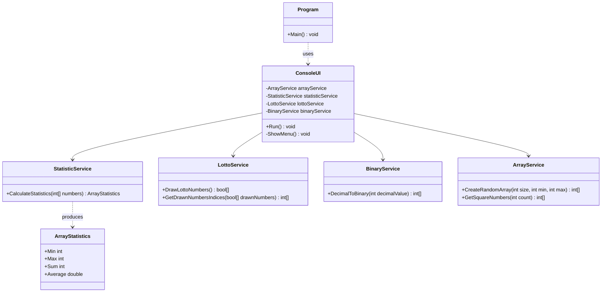

# 06_Arrays: Arrays, Listen und Algorithmen

## 📚 Theorie: Arrays in C#
Arrays sind Datenstrukturen, die eine feste Anzahl von Elementen desselben Datentyps speichern. In C# 14 und .NET 10 nutzen wir oft `Collection Expressions` für die Initialisierung.

```csharp
// Klassisch
int[] zahlen = new int[5];
// Modern (C# 12+)
int[] zahlen = [1, 2, 3, 4, 5];
```

Wichtige Eigenschaften:
*   **Feste Größe**: Nach der Erstellung nicht änderbar.
*   **0-basiert**: Der Index beginnt bei 0.
*   **Referenztyp**: Arrays sind Objekte auf dem Heap.

---

## 📝 Aufgabenstellung
> [!NOTE]
> Quelle: `06 Aufgaben Arrays eindim.pdf` (Tom Selig, BITLC)

### Aufgabe 1: Array füllen
Schreiben Sie ein Programm, das ein Array mit 10 zufälligen Integer-Werten zwischen 1 und 100 füllt. Geben Sie anschließend die 10 Werte auf der Konsole aus.

### Aufgabe 2: Quadratzahlen
Schreiben Sie ein Programm, das die Quadratzahlen von 1 bis 10 in einem Array speichert. Geben Sie die Zahlen anschließend in umgekehrter Reihenfolge wieder auf der Konsole aus.
*Output: 100, 81, ..., 1*

### Aufgabe 4: Statistik
Schreiben Sie ein Programm, das ein Array mit 10 zufälligen Zahlen zwischen 1 und 99 füllt. Geben Sie danach auf der Konsole die größte Zahl, die kleinste Zahl, den Durchschnitt der Zahlen und die Summe der Zahlen aus.

### Aufgabe 5: Lottozahlen 1
Schreiben Sie ein Programm, das 6 zufällige Zahlen zwischen 1 und 49 wählt. Speichern Sie diese aber **nicht** in einem Array der Größe 6, sondern erstellen Sie einen **Boolean-Array** der Größe 49. Markieren Sie dort die gezogenen Zahlen. Geben Sie anschließend die Zahlen auf der Konsole aus.

### Aufgabe 6: Binärzahlen 1
Schreiben Sie ein Programm, das eine maximal 8 Bit große Dezimalzahl in eine Binärzahl umrechnet. Legen Sie dazu ein Integer-Array der Größe 8 an und wenden Sie das Divisionsverfahren an.

---

## 📐 UML-Klassendiagramm (Entwurf)


