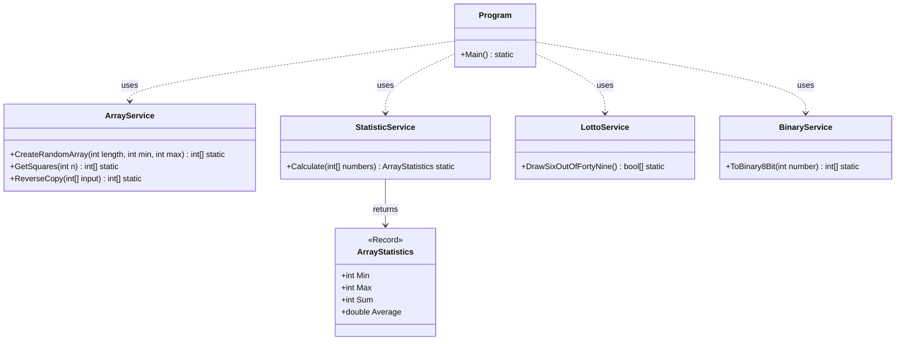

[⬅️ Zurück zum Hauptverzeichnis](../README.md)

# 06 - Arrays & Algorithmen

## 💡 Theorie
Arrays sind die fundamentalste Datenstruktur.
- **Speicher**: Fester, zusammenhängender Block.
- **Index**: Zugriff in O(1).
- **Iteration**: Ideal für `for`-Schleifen (wenn Index gebraucht wird) oder `foreach` (Read-Only).

### Array Initialisierung (Modern)
```csharp
// "Collection Expressions" in C# 12
int[] numbers = [1, 2, 3, 4, 5]; 
bool[] bools = new bool[50]; // Standard false
```

## 📝 Aufgabenstellung

### 1. Random Array
Erstellen Sie ein Array der Länge 10, gefüllt mit Zufallszahlen (1-100).

### 2. Quadratzahlen & Reverse
Berechnen Sie die Quadrate von 1 bis 10 (`[1, 4, 9...]`).
Erstellen Sie eine **Kopie**, die umgekehrt ist (`[100, 81...]`).

### 3. Statistik (Min, Max, Sum, Avg)
Analysieren Sie ein Array und ermitteln Sie:
- Minimum
- Maximum
- Summe
- Durchschnitt
*Return-Typ*: Ein `record` oder Klasse `ArrayStatistics`.

### 4. Lotto (6 aus 49)
Simulieren Sie eine Ziehung.
*Challenge*: Verwenden Sie **kein** `int[6]` für die Gezogenen, sondern ein `bool[50]`, bei dem der Index `true` gesetzt wird, wenn die Kugel gezogen wurde.
Dies vermeidet Dubletten-Prüfung durch Schleifen (O(1) Check).

### 5. Binär-Konverter (8-Bit)
Wandeln Sie eine Zahl (0-255) in binär um.
Speichern Sie die Bits in einem `int[8]`.
*Beispiel*: `42` -> `[0,0,1,0,1,0,1,0]`

## 🧩 UML Klassendiagramm



## ✅ Definition of Done
- [ ] Alle Services sauber getrennt (SFC).
- [ ] Lotto-Logik nutzt Bool-Array (O(1)).
- [ ] Binär-Logik funktioniert für Randwerte (0, 255).
- [ ] XML Dokumentation vollständig.
- [ ] Unit Tests grün.
