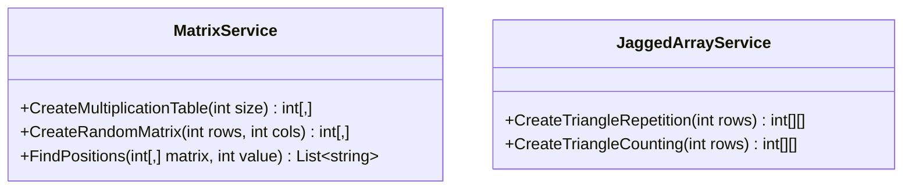

# 07_ArraysMulti: Mehrdimensionale & Verzweigte Arrays

## 📚 Theorie
Während einfache Arrays wie eine **Liste** sind, sind mehrdimensionale Arrays wie **Tabellen** (Excel) oder **Würfel**.

### 1. Rechteckige Arrays (Multidimensional)
Das klassische 2D-Array (`int[,]`) ist ein Gitter. Jede Zeile hat **immer** dieselbe Anzahl an Spalten.

**Vorstellung:**
```
      Spalte 0   Spalte 1   Spalte 2
Zeile 0 [  1  ]   [  2  ]   [  3  ]
Zeile 1 [  4  ]   [  5  ]   [  6  ]
```

**Code:**
```csharp
// Definition: [Zeilen, Spalten]
int[,] matrix = new int[2, 3]; 

// Zugriff:
matrix[0, 1] = 2; // Zeile 0, Spalte 1
int zeilen = matrix.GetLength(0); // 2
int spalten = matrix.GetLength(1); // 3

// Iteration:
for(int r = 0; r < matrix.GetLength(0); r++) {
    for(int c = 0; c < matrix.GetLength(1); c++) {
        Console.Write(matrix[r, c]); 
    }
}
```

### 2. Verzweigte Arrays (Jagged Arrays)
Ein "Array von Arrays" (`int[][]`). Hier kann jede "Zeile" eine **unterschiedliche Länge** haben. Das ist flexibler, aber etwas komplexer in der Erzeugung.

**Vorstellung (Dreieck):**
```
Zeile 0 [ 1 ]
Zeile 1 [ 1 ] [ 2 ]
Zeile 2 [ 1 ] [ 2 ] [ 3 ]
```

**Code:**
```csharp
// 1. Haupt-Array erstellen (Anzahl Zeilen)
int[][] ragged = new int[3][]; 

// 2. Unter-Arrays erstellen (Länge pro Zeile definieren)
ragged[0] = new int[1]; 
ragged[1] = new int[2];
ragged[2] = [1, 2, 3]; // Kurzform

// Zugriff:
// Erst Zeile, dann Spalte (separate Klammern!)
ragged[2][0] = 99; 
```

---

## 📝 Aufgabenstellung
> [!NOTE]
> Quelle: `07 Aufgaben Arrays mehrdim.pdf` (Tom Selig, BITLC)

### Aufgabe 1: Array füllen
Schreiben Sie ein Programm, das ein 2x2 Array für Integer-Zahlen erzeugt. Der Benutzer soll dann aufgefordert werden die Zahlen für alle Positionen einzugeben.

### Aufgabe 2: Kleines 1x1
Schreiben Sie ein Programm, das das kleine 1x1 in einem zweidimensionalen Array speichert und anschließend auf der Konsole ausgibt.

### Aufgabe 3: Durch 7 teilbar
Schreiben Sie ein Programm, das ein 7x7 Array mit zufälligen Zahlen zwischen 1 und 99 füllt. Anschließend gibt das Programm das Array auf der Konsole aus und dazu alle Zahlen im Array, die durch 7 teilbar sind.

### Aufgabe 4: Array-Suche
Schreiben Sie ein Programm, das ein 10x10 Array mit Zufallszahlen zwischen 1 und 99 füllt und diese auf der Konsole ausgibt. Der Benutzer kann dann eine Zahl eingeben, und das Programm gibt die Position(en) aus, an der diese Zahl im Array steht.

### Aufgabe 5: Verzweigtes Array 1
Schreiben Sie ein Programm, das ein verzweigtes Array erzeugt, dieses wie unten abgebildet befüllt und anschließend auf der Konsole ausgibt.
```
1
2 2
3 3 3
...
```

### Aufgabe 6: Verzweigtes Array 2
Schreiben Sie ein Programm, das ein verzweigtes Array erzeugt, dieses wie unten abgebildet befüllt und anschließend auf der Konsole ausgibt.
```
1
1 2
1 2 3
...
```

---

## 📐 UML-Klassendiagramm


