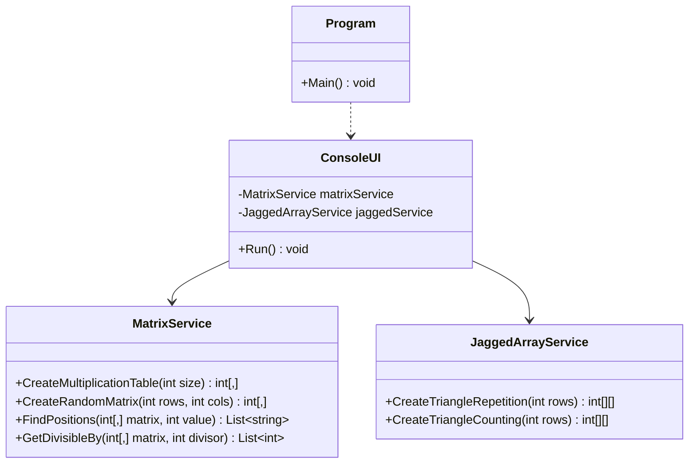

# 07_ArraysMulti: Mehrdimensionale Arrays

## 📚 Theorie
Mehrdimensionale Arrays in C# unterteilen sich in:
1.  **Rechteckige Arrays (Multidimensional)**: `int[,]` - Haben feste Dimensionen (Matrix).
2.  **Verzweigte Arrays (Jagged)**: `int[][]` - Ein Array von Arrays, die unterschiedlich lang sein können.

```csharp
// Rechteckig (2x3)
int[,] matrix = new int[2, 3] { {1,2,3}, {4,5,6} };

// Verzweigt
int[][] jagged = new int[2][];
jagged[0] = new int[3];
jagged[1] = new int[5];
```

---

## 📝 Aufgabenstellung
> [!NOTE]
> Quelle: `07 Aufgaben Arrays mehrdim.pdf`

### Aufgabe 1: Array füllen (2x2)
Erzeugen Sie ein 2x2 Array. Lassen Sie den Benutzer die Werte eingeben und geben Sie diese anschließend formatiert wieder aus.

### Aufgabe 2: Kleines 1x1
Speichern Sie das kleine 1x1 (1-10) in einem 2D-Array und geben Sie es als Tabelle aus.

### Aufgabe 3: Durch 7 teilbar (7x7)
Füllen Sie ein 7x7 Array mit Zufallszahlen (1-99). Geben Sie das Array aus und filtern Sie anschließend alle Zahlen, die durch 7 teilbar sind.

### Aufgabe 4: Array-Suche (10x10)
Füllen Sie ein 10x10 Array mit Zufallszahlen (1-99). Der Benutzer sucht eine Zahl. Das Programm gibt **alle** Positionen `[Zeile, Spalte]` aus, an denen die Zahl gefunden wurde.

### Aufgabe 5: Verzweigtes Array 1
Erzeugen Sie ein `int[][]`, das folgende Struktur abbildet:
```
1
2 2
3 3 3
...
7 7 7 7 7 7 7
```

### Aufgabe 6: Verzweigtes Array 2
Ähnlich wie Aufgabe 5, aber mit fortlaufenden bzw. zählenden Werten:
```
1
1 2
1 2 3
...
1 2 3 4 5 6 7
```

---

## 📐 UML-Klassendiagramm


