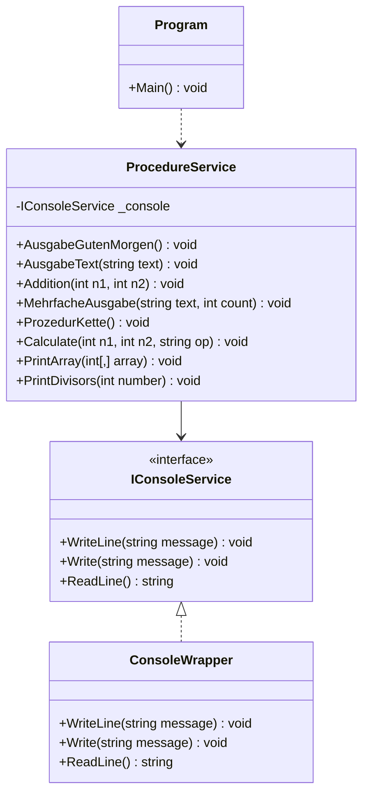

# 08_Procedures: Unterprogramme (Prozeduren)

## 📚 Theorie
Prozeduren sind Methoden, die **keinen Rückgabewert** (`void`) haben. Sie dienen primär der Ausführung von Aktionen (z.B. Konsolenausgabe, Datenmanipulation) ohne ein direktes Ergebnis zurückzuliefern.

```csharp
public void SayHello(string name)
{
    Console.WriteLine($"Hallo {name}!");
}
```

Um solche Methoden testbar zu machen (TDD), sollten wir direkte Aufrufe von `Console.WriteLine` vermeiden und stattdessen Abstraktionen (Interfaces) verwenden.

---

## 📝 Aufgabenstellung
> [!NOTE]
> Quelle: `08 Aufgaben Unterprogramme Prozeduren.pdf`

### Aufgabe 1: Hallo Welt
Prozedur `AusgabeGutenMorgen()`: Gibt "Guten Morgen!" aus.

### Aufgabe 2: Parameter
Prozedur `AusgabeText(string text)`: Gibt den übergebenen Text aus.

### Aufgabe 3: Input & Output
Benutzer gibt Text ein -> Prozedur gibt ihn wieder aus.

### Aufgabe 4: Addition
Prozedur `Addition(int n1, int n2)`: Berechnet Summe und gibt sie aus (Format: "Das Ergebnis der Addition ist X.").

### Aufgabe 5: Mehrfache Ausgabe
Prozedur `MehrfacheAusgabe(string text, int count)`: Gibt den Text `count` mal aus.

### Aufgabe 6: Verkettung
`Prozedur1` ruft `Prozedur2` ruft `Prozedur3`. Jede gibt ihren Namen aus.

### Aufgabe 7: Taschenrechner
Prozeduren für `Add`, `Sub`, `Mult`, `Div`. User gibt Zahlen und Operator ein.

### Aufgabe 8: Array Ausgabe
Prozedur `PrintArray(int[,] array)`: Gibt ein 2D-Array formatiert aus.

### Aufgabe 9: Teiler
Prozedur `PrintDivisors(int number)`: Gibt alle Teiler einer Zahl aus.

---

## 📐 UML-Klassendiagramm


