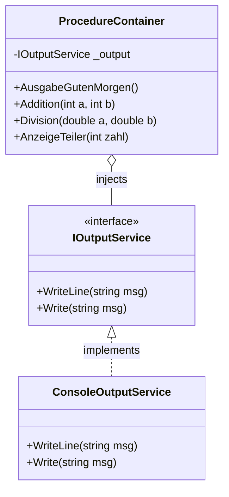

[⬅️ Zurück zum Hauptverzeichnis](../README.md)

# 08 - Prozeduren (Void Methoden)

## 💡 Theorie
Prozeduren sind Methoden ohne Rückgabewert (`void`). Sie führen Befehle aus (Side-Effects).
Das macht sie schwerer zu testen, da sie kein Ergebnis `return`-en, sondern z.B. nur auf die Konsole schreiben.

### Dependency Injection (Testbarkeit)
Um `Console.WriteLine` testbar zu machen, nutzen wir ein Interface:
```csharp
public interface IOutputService { void WriteLine(string s); }

// Im Code nutzen wir NUR das Interface:
class MyService(IOutputService output) {
    public void DoWork() => output.WriteLine("Work Done");
}
```
So können wir im Test das "Schreiben" abfangen und prüfen!

## 📝 Aufgabenstellung
Implementieren Sie diverse Prozeduren (siehe Source):
1.  `AusgabeGutenMorgen()`
2.  `AusgabeText(string text)`
3.  `Addition(int a, int b)`
4.  `AusgabeText(string text, int anzahl)`
5.  `Prozedur1` -> `Prozedur2` -> `Prozedur3` (Verkettung)
6.  `Taschenrechner` (Add, Sub, Mul, Div) mit Fehlerbehandlung für Div/0.
7.  `ArrayAusgabe(int[,] matrix)`
8.  `AnzeigeTeiler(int zahl)`

## 🧩 UML Klassendiagramm



## ✅ Definition of Done
- [ ] Alle Ausgaben laufen über `IOutputService`.
- [ ] Unit Tests nutzen einen `MockOutputService`.
- [ ] Division durch Null fängt Fehler ab.
