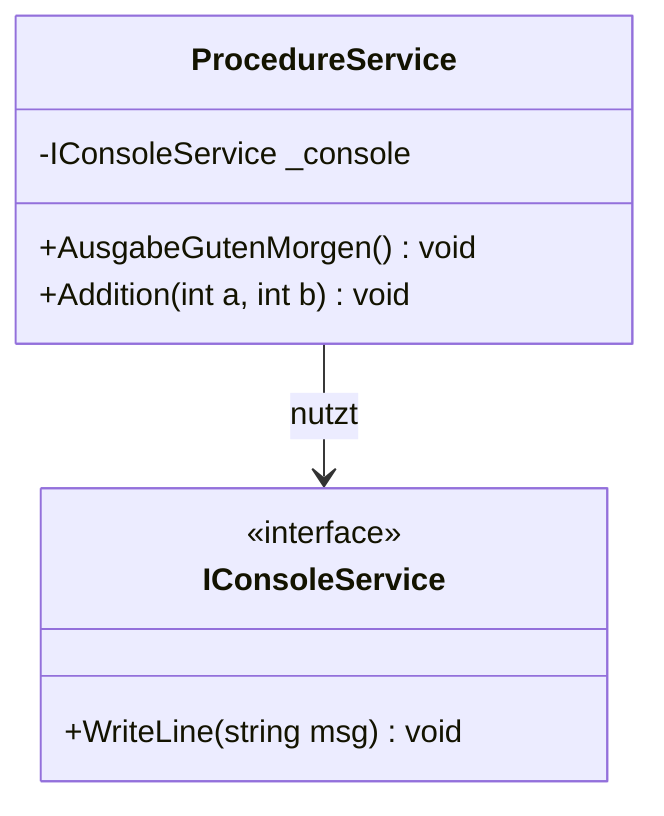

# 08_Procedures: Unterprogramme & Clean Code

## 📚 Theorie

### 1. Was ist eine Prozedur?
In der Theorie unterscheidet man oft:
*   **Funktion**: Berechnet etwas und gibt ein Ergebnis zurück (`return ...`).
*   **Prozedur**: Führt eine Aktion aus (z.B. Drucken, Speichern) und gibt **nichts** zurück (`void`).

In C# nennen wir beides **Methoden**, aber der Begriff "Prozedur" deutet meist auf `void` hin.

```csharp
// Prozedur (void)
public void DruckeDatum() {
    Console.WriteLine(DateTime.Now);
}

// Funktion (return type)
public string GetDatum() {
    return DateTime.Now.ToString();
}
```

### 2. Parameterübergabe
Methoden können Eingaben (Parameter) erhalten.
*   **Pass-by-Value (Standard)**: Der *Wert* wird kopiert. Änderungen in der Methode ändern das Original nicht.
*   **Best Practice**: Parameter sollten sprechende Namen haben (z.B. `anzahlWiederholungen` statt `i`).

### 3. Testbarkeit & Clean Code (TDD)
Ein großes Problem bei Prozeduren, die `Console.WriteLine` benutzen, ist das Testen.
Wie überprüft ein automatischer Test, ob "Hallo" auf den schwarzen Bildschirm geschrieben wurde?

**Lösung: Dependency Injection & Interfaces**
Statt direkt `Console` zu rufen, nutzen wir einen Zwischenhändler (Interface `IConsoleService`).

1.  **Im echten Programm**: Der Service schreibt wirklich auf die Konsole.
2.  **Im Test**: Der Service schreibt in eine Liste (`Mock`), die wir prüfen können.

> [!IMPORTANT]
> Das ist das Prinzip der **Separation of Concerns (SoC)**. Unsere Logik weiß nicht, *wohin* sie schreibt, nur *dass* sie schreibt.

---

## 📝 Aufgabenstellung
> [!NOTE]
> Quelle: `08 Aufgaben Unterprogramme Prozeduren.pdf` (Tom Selig, BITLC)

### Aufgabe 1: Ausgabe1
Schreiben Sie ein Programm, das eine Prozedur `AusgabeGutenMorgen()` enthält. Die Prozedur soll beim Aufruf immer den Text „Guten Morgen!“ auf der Konsole ausgeben.

### Aufgabe 2: Ausgabe2
Schreiben Sie ein Programm, das eine Prozedur `AusgabeText()` enthält. Die Prozedur soll einen Parameter text vom Typ string haben.

### Aufgabe 3: Ausgabe3
Schreiben Sie ein Programm, das eine Prozedur `AusgabeText()` enthält. Der Benutzer soll diesmal im Hauptprogramm einen Text eingeben, und die Prozedur gibt diesen Text bei Aufruf wieder auf der Konsole aus.

### Aufgabe 4: Addition1
Schreiben Sie ein Programm, das eine Prozedur `Addition()` enthält. Die Prozedur soll zwei Parameter zahl1 und zahl2 vom Typ int haben.

### Aufgabe 5: Mehrfache Ausgabe
Schreiben Sie ein Programm, das eine Prozedur `AusgabeText()` enthält. Die Prozedur hat einen Parameter text vom Typ string und einen weiteren Parameter anzahl vom Typ int.

### Aufgabe 6: Prozeduren-Verkettung
Schreiben Sie ein Programm, das die drei Prozeduren `Prozedur1()`, `Prozedur2()` und `Prozedur3()` enthält.

### Aufgabe 7: Taschenrechner
Schreiben Sie ein Programm, das einen simplen Taschenrechner simuliert. Im Programm gibt es die vier Prozeduren `Addition()`, `Subtraktion()`, `Multiplikation()` und `Division()`.

### Aufgabe 8: Array-Ausgabe
Schreiben Sie ein Programm, das eine Prozedur `ArrayAusgabe()` enthält. Die Prozedur hat einen Parameter array vom Typ `int[,]`.

### Aufgabe 9: Teiler
Schreiben Sie ein Programm, das eine Prozedur `AnzeigeTeiler()` enthält. Die Prozedur hat einen Parameter zahl vom Typ int.

---

## 📐 UML-Klassendiagramm


