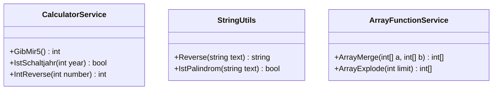

[⬅️ Zurück zum Hauptverzeichnis](../README.md)

# 09 - Funktionen (Rückgabewerte)

## 💡 Theorie
Funktionen sind Methoden mit Rückgabewert (`return`).
Sie ermöglichen das EVA-Prinzip auf Code-Ebene: **E**ingabe -> **V**erarbeitung -> **A**usgabe (Return).

### Pure Functions
Funktionen ohne Seiteneffekte (schreiben nicht auf Konsole, ändern keine globalen Variablen) sind "pure".
Sie sind:
- 🧪 Leicht testbar (Input -> Output)
- ♻️ Wiederverwendbar
- ⚡ Parallelisierbar

## 📝 Aufgabenstellung
Eine Sammlung von 15 Aufgaben, implementiert in modularen Services:
- **CalculatorService**: `GibMir5`, `Addition`, `Schaltjahr`, `TempCoverter`.
- **StringUtils**: `Reverse`, `Palindrom`.
- **ArrayFunctionService**: `Merge`, `Explode`.
- **InputService**: Sichere `EingabeInt` Loop.

## 🧩 UML Klassendiagramm

## ✅ Definition of Done
- [ ] Alle Berechnungen sind in static Services ausgelagert (SFC).
- [ ] `Program.cs` macht nur I/O, keine Logik.
- [ ] Unit Tests decken Grenzfälle (z.B. Schaltjahr 1900) ab.
