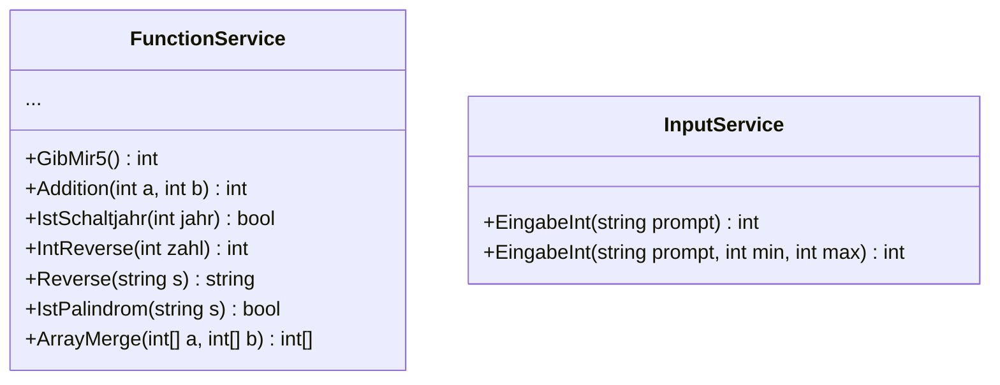

# 09_Functions: Funktionen & Rückgabewerte

## 📚 Theorie

### 1. Was ist eine Funktion?
Im Gegensatz zu einer Prozedur (`void`) gibt eine Funktion ein **Ergebnis** zurück.
Das ist extrem wichtig für **Testbarkeit** und **Wiederverwendbarkeit**.

**Mathematisches Beispiel:**
`f(x) = x * 2`
Wenn wir `5` hineinwerfen, kommt `10` heraus. Die Funktion druckt die 10 nicht auf ein Blatt Papier (Konsole), sondern gibt sie uns in die Hand (return).

```csharp
// Definition
public int Verdopple(int zahl) {
    return zahl * 2;
}

// Aufruf
int ergebnis = Verdopple(5); // ergebnis ist 10
Console.WriteLine(ergebnis); // Erst HIER drucken wir!
```

### 2. Pure Functions (Reine Funktionen)
Eine Funktion ist "rein", wenn:
1.  Sie bei gleicher Eingabe immer das gleiche Ergebnis liefert.
2.  Sie keine Seiteneffekte hat (nichts auf die Konsole schreibt, keine globalen Variablen ändert).

**Vorteil**: Solche Funktionen sind **perfekt testbar**.

### 3. Rückgabetypen
Jede Methode muss angeben, was sie zurückgibt:
*   `int`: Ganze Zahl
*   `bool`: Wahr/Falsch (oft für Prüfungen: `IstSchaltjahr`)
*   `string`: Text
*   `int[]`: Ein ganzes Array

---

## 📝 Aufgabenstellung
> [!NOTE]
> Quelle: `09 Aufgaben Unterprogramme Funktionen.pdf` (Tom Selig, BITLC)

### Aufgabe 1: Gib mir 5
Funktion `GibMir5()`: Hat keine Parameter, gibt immer `5` (int) zurück.

### Aufgabe 2: Addition
Funktion `Addition(int z1, int z2)`: Gibt die Summe zurück.

### Aufgabe 3: Schaltjahr
Funktion `IstSchaltjahr(int jahr)`: Gibt `true` zurück, wenn es ein Schaltjahr ist.
*Regel: Teilbar durch 4, aber NICHT durch 100, außer durch 400.*

### Aufgabe 4: Taschenrechner
Funktionen für `Add`, `Sub`, `Mult`, `Div`, die das Ergebnis zurückgeben.

### Aufgabe 5: Temperatur-Umrechnung
6 Funktionen zur Umrechnung zwischen Celsius, Kelvin, Fahrenheit: `CnachF`, `CnachK`, `FnachC`, etc.

### Aufgabe 6: Bankkonto
Simulation mit Variable `kontostand` (decimal). Funktionen für Einzahlen/Abheben.

### Aufgabe 7: Integer umdrehen
Funktion `IntReverse(int zahl)`: Dreht die Zahl um (1234 -> 4321). Mathematisch lösen (Modulo/Division)!

### Aufgabe 8: Funktionen-Wahnsinn
Verkettung von 4 Funktionen, die sich gegenseitig Werte weitergeben.
`F1` erhöht x+1 -> `F2` speichert y, addiert x+y -> etc.

### Aufgabe 9: String Reverse
Funktion `Reverse(string text)`: Gibt den umgedrehten Text zurück (selbst implementieren!).

### Aufgabe 10: Palindrom
Funktion `IstPalindrom(string text)`: Prüft (case-insensitive), ob ein Wort vorwärts/rückwärts gleich ist. Nutzt `Reverse`.

### Aufgabe 11: Array Merge
Funktion `ArrayMerge(int[] a1, int[] a2)`: Fasst zwei Arrays zu einem sortierten Array zusammen.

### Aufgabe 12: Array Explode
Funktion `ArrayExplode(int grenze)`: Erzeugt Array nach Muster: 1, 1,2, 1,2,3... bis grenze.

### Aufgabe 13-15: Sichere Eingaben
Funktionen `EingabeInt()`, `EingabeDouble()`, `EingabeBool()`, die so lange fragen, bis die Eingabe korrekt ist.

---

## 📐 UML-Klassendiagramm


