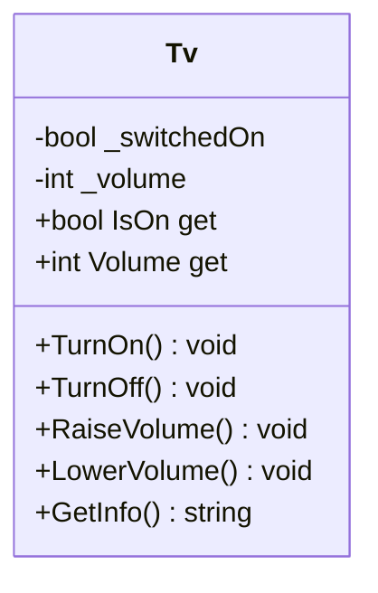

[⬅️ Zurück zum Hauptverzeichnis](../README.md)

# 10 - Klassen & Objekte (Einstieg OOP)

## 💡 Theorie
Hier beginnt die Objektorientierung (OOP).
Wir modellieren die Realität, indem wir Daten (Zustand) und Logik (Verhalten) in **Klassen** bündeln.

### Kapselung (Encapsulation)
Ein zentrales Prinzip: **Verstecke die Daten (`private`), zeige das Verhalten (`public`).**
Wir wollen nicht, dass jemand `Lautstärke = -100` setzt. Wir wollen `LeiserMachen()`.

```csharp
class Auto {
    private int geschwindigkeit; // Niemand darf das direkt ändern!

    public void Beschleunigen() {
        geschwindigkeit += 10; // Wir kontrollieren die Änderung.
    }
}
```

## 📝 Aufgabenstellung
Entwickeln Sie eine Klasse `Tv`:
- **Zustand**:
  - `IsOn`: Ist der TV an?
  - `Volume`: Lautstärke (0-100).
- **Verhalten**:
  - `TurnOn()`, `TurnOff()`
  - `RaiseVolume()`, `LowerVolume()`
  - `GetInfo()`

**Wichtig**: Die Lautstärke darf nur geändert werden, wenn der TV an ist!

## 🧩 UML Klassendiagramm



## ✅ Definition of Done
- [ ] Felder sind `private` (`_volume`).
- [ ] Properties sind `public` (Read-Only via `get`).
- [ ] Logik verhindert ungültige Zustände (<0, >100).
- [ ] Integrationstests prüfen TV-Verhalten.
