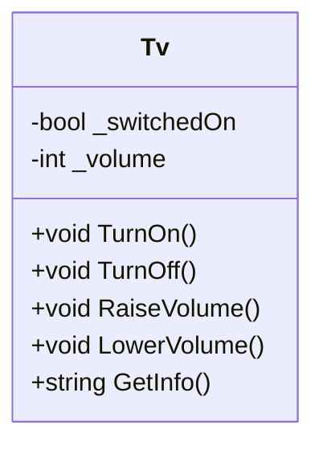

# 10_Classes: Einführung in Klassen & Objekte

## 📚 Theorie

### 1. Bauplan (Klasse) vs. Haus (Objekt)
Eine **Klasse** ist wie ein Bauplan (Architekturzeichnung). Er beschreibt, wie ein Haus aussehen *könnte*.
Ein **Objekt** ist das tatsächliche Haus, das nach diesem Plan gebaut wurde.

*   **Klasse**: `Auto` (hat 4 Räder, Farbe, Motor)
*   **Objekt**: `MeinRoterGolf`, `DeinBlauerBMW`

```csharp
// Definition (Bauplan)
public class Auto {
    public string Farbe;
    public void Fahren() { ... }
}

// Instanziierung (Bau)
Auto meinAuto = new Auto();
meinAuto.Farbe = "Rot";
```

### 2. Kapselung (Encapsulation)
Wir wollen nicht, dass jeder direkt am "Motor" herumschraubt. Deshalb machen wir Variablen oft `private` (versteckt) und bieten Methoden (`public`) an, um sie kontrolliert zu ändern.

*   **Falsch**: `tv.Volume = -100;` (Direkter Zugriff, unsinniger Wert)
*   **Richtig**: `tv.LowerVolume();` (Methode prüft, ob es nicht schon 0 ist)

---

## 📝 Aufgabenstellung
> [!NOTE]
> Quelle: `03 Aufgabe TV.pdf` (Tom Selig, BITLC)

### Aufgabe: Klasse TV
Erstellen Sie eine Klasse `Tv` für einen einfachen Fernseher.

**Attribute (Zustand):**
*   `switchedOn` (bool): Ist der TV an?
*   `volume` (int): Aktuelle Lautstärke.

**Methoden (Verhalten):**
1.  `TurnOn()`: Schaltet das Gerät ein.
2.  `TurnOff()`: Schaltet das Gerät aus.
3.  `RaiseVolume()`: Erhöht Lautstärke (max 100).
4.  `LowerVolume()`: Verringert Lautstärke (min 0).
5.  `GetInfo()`: Gibt den Status als Text zurück (An/Aus, Lautstärke).

### Erweiterungen (b-e)
*   Lautstärke darf nur zwischen 0 und 100 liegen.
*   Schrittweite der Lautstärke anpassbar machen.
*   (Optional) Programm / Senderwahl.

---

## 📐 UML-Klassendiagramm


