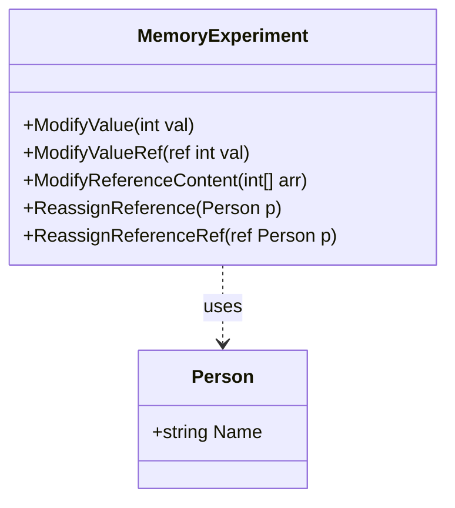

[⬅️ Zurück zum Hauptverzeichnis](../README.md)

# 11 - Wert- und Referenztypen

## 💡 Theorie
Das Verständnis von Speicher ist der Schlüssel zu C#.
- **Stack**: Werte (`int`, `struct`). Kopie bei Zuweisung.
- **Heap**: Objekte (`class`, `Array`). Adresse bei Zuweisung.

### Wichtige Unterscheidung
| Typ | Beispiel | Verhalten bei `a = b` |
| --- | --- | --- |
| **Value Type** | `int`, `bool`, `struct` | **Kopie**: Werte sind unabhängig. |
| **Reference Type** | `class`, `string`, `Array` | **Referenz**: Beide zeigen auf dasselbe Haus. |

### Das `ref` Keyword
Mit `ref` können wir erzwingen, dass eine Variable "By Reference" übergeben wird. Die Methode arbeitet dann direkt mit dem Original des Aufrufers.

```csharp
void Manipulate(ref int x) { x = 0; }
```

## 📝 Aufgabenstellung
Experimentieren Sie mit dem Speicher:
1.  Ändern Sie ein `int` in einer Methode -> Original bleibt gleich.
2.  Ändern Sie ein `int` mit `ref` -> Original ändert sich.
3.  Ändern Sie den Inhalt eines Arrays (`class`) -> Original ändert sich.
4.  Versuchen Sie, ein Objekt neu zuzuweisen (`person = new ...`) -> Ohne `ref` passiert nichts beim Aufrufer!

## 🧩 UML Klassendiagramm



## ✅ Definition of Done
- [ ] Unterschied zwischen `ModifyValue` und `ModifyReference` verstanden.
- [ ] Tests beweisen, dass Arrays Referenztypen sind.
- [ ] Tests beweisen, dass `int` Wertetypen sind.
