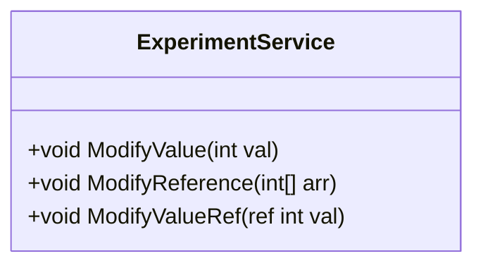

# 11_ValueReferences: Wert- und Referenztypen

## 📚 Theorie

### 1. Der Speicher: Stack vs. Heap
C# verwaltet Speicher in zwei Bereichen:
*   **Stack (Stapel)**: Extrem schnell, klein, aufgeräumt. Hier leben einfache Variablen (`int`, `bool`, `double`) und Referenzen.
*   **Heap (Haufen)**: Groß, chaotischer. Hier leben komplexe Objekte (`new Class()`, Arrays).

### 2. Wertetypen (Value Types)
*   Beispiele: `int`, `bool`, `double`, `struct`.
*   Verhalten: Die Variable enthält den **Wert direkt**.
*   Zuweisung: `a = b` kopiert den Wert. Änderungen an `a` ändern `b` nicht.

### 3. Referenztypen (Reference Types)
*   Beispiele: `string`, `class`, `int[]` (Arrays!).
*   Verhalten: Die Variable enthält eine **Speicheradresse** (Referenz), die auf das Objekt im Heap zeigt.
*   Zuweisung: `a = b` kopiert nur die Adresse. Beide zeigen auf **dasselbe Objekt**. Änderungen an `a` ändern auch `b`!

### 4. `ref` Keyword
Mit `ref` kann man erzwingen, dass auch Wertetypen als Referenz übergeben werden.

---

## 🔬 Experimente
> [!NOTE]
> Quelle: `03 C# - Wert- und Referenztypen - 202512.pdf` (Tom Selig, BITLC)

### Experiment 1: Wertetyp Kopie
Zeigen Sie, dass bei `int` eine Kopie erstellt wird.
```csharp
int a = 5;
int b = a;
b = 10;
// a ist immer noch 5
```

### Experiment 2: Referenztyp (Array)
Zeigen Sie, dass bei Arrays beide Variablen auf dasselbe Array zeigen.
```csharp
int[] a = { 1 };
int[] b = a;
b[0] = 99;
// a[0] ist jetzt auch 99!
```

### Experiment 3: `ref` Parameter
Schreiben Sie eine Methode `Swap(ref int a, ref int b)`, die zwei Zahlen wirklich tauscht (nicht nur lokal).

---

## 📐 UML-Klassendiagramm


