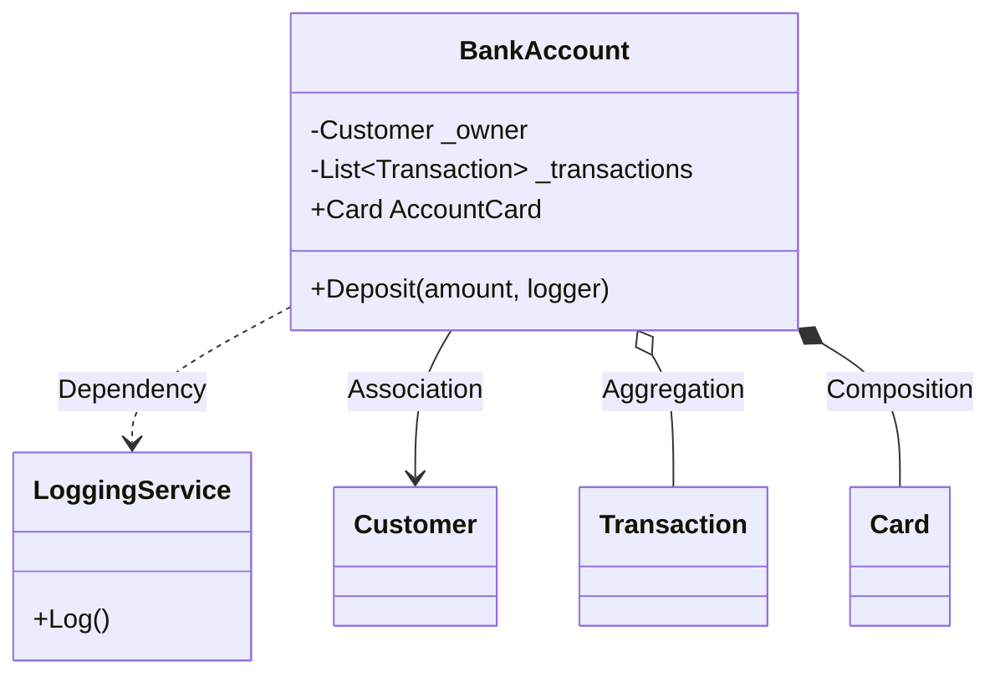

[⬅️ Zurück zum Hauptverzeichnis](../README.md)

# 12 - Beziehungen (Relationships)

## 💡 Theorie
Objekte agieren selten allein. Wir unterscheiden 4 Grade der Kopplung:

### 1. Abhängigkeit (Dependency) - "Benutzt"
`BankAccount` benutzt `LoggingService` nur für die Methode `Deposit`.
- **Code:** Parameter in Methode.
- **Lebensdauer:** Unabhängig.

### 2. Assoziation (Association) - "Hat ein"
`BankAccount` kennt `Customer`.
- **Code:** Feld / Property.
- **Lebensdauer:** Unabhängig (Kunde lebt auch ohne Konto).

### 3. Aggregation - "Besteht aus"
`BankAccount` hat eine Liste von `Transaction`s.
- **Code:** List / Collection.
- **Lebensdauer:** Teile gehören zum Ganzen.

### 4. Komposition (Composition) - "Existiert durch"
`BankAccount` hat eine `Card`.
- **Code:** Erstellung (`new`) passiert IM Konstruktor des Ganzen.
- **Lebensdauer:** Wenn Konto gelöscht wird, ist die Karte auch weg.

## 📝 Aufgabenstellung
Implementierung eines Bank-Systems, das alle 4 Beziehungen demonstriert.

## 🧩 UML Klassendiagramm

## ✅ Definition of Done
- [ ] Alle 4 Beziehungen im Code sichtbar.
- [ ] Unittests prüfen, ob Composition (Karte da) und Aggregation (Balance stimmt) funktionieren.
