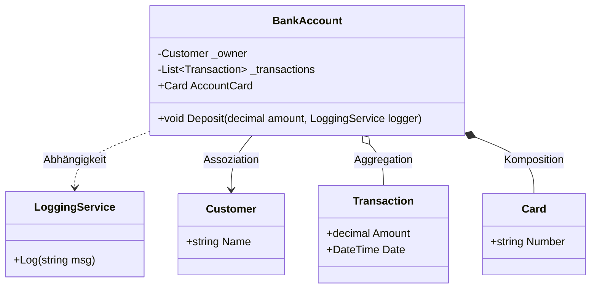

# 12_Relationships: Beziehungen zwischen Klassen

## 📚 Theorie

Objekte existieren selten allein. Sie interagieren miteinander. Wir unterscheiden 4 Hauptarten von Beziehungen (Stärke aufsteigend):

### 1. Abhängigkeit (Dependency)
*   **"Benutzt"** (uses)
*   Das Objekt braucht ein anderes Objekt kurzzeitig, um eine Aufgabe zu erledigen.
*   Beispiel: `BankAccount` benutzt `LoggingService` zum Protokollieren einer Einzahlung. Der Logger wird meist als Parameter übergeben und nicht gespeichert.

### 2. Assoziation (Association)
*   **"Hat ein"** (has a)
*   Das Objekt kennt ein anderes Objekt dauerhaft.
*   Beispiel: `BankAccount` hat einen `Customer` (Besitzer).
*   Beide Objekte können unabhängig voneinander existieren (Der Kunde existiert auch ohne das Konto).

### 3. Aggregation
*   **"Besteht aus"** (Teil-Ganzes)
*   Eine hohle Raute im UML.
*   Beispiel: `BankAccount` hat eine Liste von `Transaction`s.
*   Die Teile (Transaktionen) gehören zum Ganzen, könnten aber theoretisch auch woanders existieren (weniger streng als Komposition).

### 4. Komposition (Composition)
*   **"Existenzabhängig"** (Starkes Teil-Ganzes)
*   Eine gefüllte Raute im UML.
*   Beispiel: `BankAccount` hat eine `Card` (Kreditkarte).
*   Wenn das Konto gelöscht wird, macht die Karte keinen Sinn mehr und wird mit gelöscht.

---

## 📝 Implementierung
> [!NOTE]
> Quelle: `06 Einführung in die OOP mit C# - Teil 2 - 202512.pdf` (Tom Selig, BITLC)

Wir implementieren das `BankAccount`-Beispiel aus den Folien, das alle 4 Beziehungen zeigt.

---

## 📐 UML-Klassendiagramm

