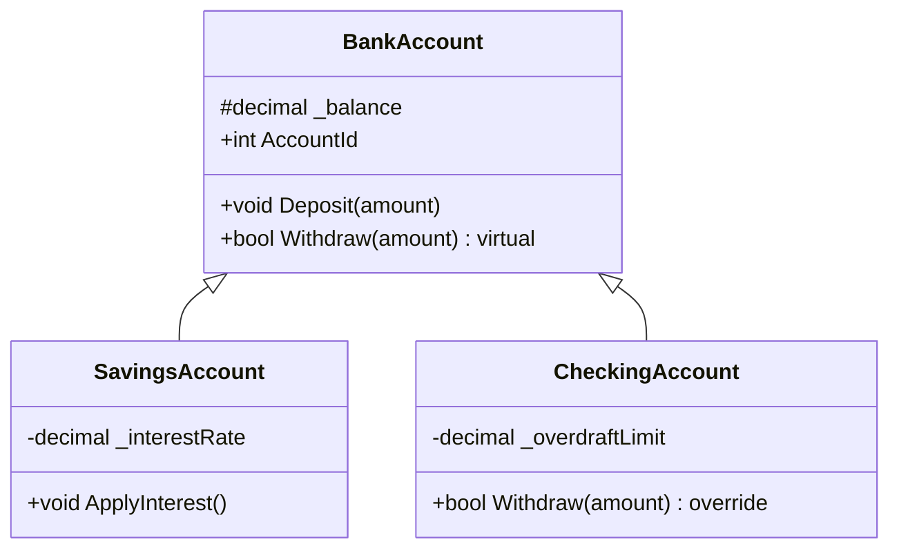

[⬅️ Zurück zum Hauptverzeichnis](../README.md)

# 13 - Vererbung (Inheritance)

## 💡 Theorie
Vererbung erlaubt es, gemeinsame Logik in eine **Basisklasse** auszulagern (`BankAccount`) und spezifische Logik in **Subklassen** (`SavingsAccount`, `CheckingAccount`) zu implementieren.

### Keywords
- `virtual`: Erlaubt einer Methode, überschrieben zu werden.
- `override`: Überschreibt eine virtuelle Methode.
- `base`: Ruft die Basisklasse auf (z.B. Konstruktor).
- `protected`: Sichtbar für Kinder, aber nicht für die Öffentlichkeit.

## 📝 Aufgabenstellung
Ein Bankensystem mit verschiedenen Kontotypen:
1.  **BankAccount**: Kann einzahlen und abheben (Standard).
2.  **SavingsAccount**: Zinsen anwenden.
3.  **CheckingAccount**: Dispokredit nutzen (Überschreibt `Withdraw`).

## 🧩 UML Klassendiagramm

## ✅ Definition of Done
- [ ] `BankAccount` definiert `virtual Withdraw`.
- [ ] `CheckingAccount` nutzt `override Withdraw` für Dispo.
- [ ] Konstruktoren nutzen `base(...)`.
- [ ] Tests prüfen spezifisches Verhalten (Zinsen, Dispo-Limit).
