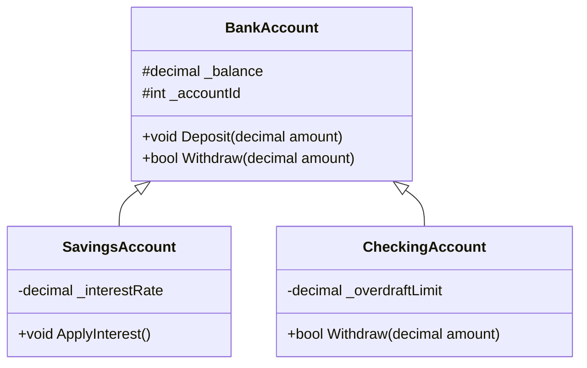

# 13_Inheritance: Vererbung

## 📚 Theorie

### 1. Vererbung (Inheritance)
Eine der mächtigsten Eigenschaften der OOP. Eine Klasse (Subklasse) kann Eigenschaften und Methoden einer anderen Klasse (Basisklasse) erben.
*   **Vorteil**: Wiederverwendung von Code (DRY - Don't Repeat Yourself).
*   **Syntax**: `class Hund : Tier { ... }`

### 2. `protected`
Ein Zugriffsmodifizierer zwischen `private` und `public`.
*   `private`: Nur innerhalb der *eigenen* Klasse sichtbar.
*   `protected`: Innerhalb der eigenen Klasse UND in allen *abgeleiteten* Klassen sichtbar.

### 3. `base` Keyword
*   Aufruf des Konstruktors der Basisklasse: `: base(parameter)`
*   Zugriff auf Methoden der Basisklasse: `base.Method()`

### 4. Typ-Prüfung und Casting
*   `obj is Typ`: Prüft, ob ein Objekt von einem bestimmten Typ ist (oder davon erbt).
*   `obj as Typ`: Versucht zu casten. Gibt `null` zurück, wenn es nicht klappt (statt Absturz).

---

## 📝 Aufgabenstellung
> [!NOTE]
> Quelle: `08 Einführung in die OOP mit C# - Teil 3 - 202601.pdf` (Tom Selig, BITLC)

### Klassenhierarchie: BankAccount
Wir implementieren das klassische Beispiel aus den Folien.

**1. Basisklasse: `BankAccount`**
*   Felder: `_balance` (decimal), `_accountId` (int).
*   Methoden: `Deposit(amount)`, `Withdraw(amount)`.
*   Besonderheit: `Deposit` ist für alle gleich.

**2. Subklasse: `SavingsAccount` (Sparbuch)**
*   Zusätzlich: `_interestRate` (Zinssatz).
*   Methode: `ApplyInterest()` (Zinsen gutschreiben).

**3. Subklasse: `CheckingAccount` (Girokonto)**
*   Zusätzlich: `_overdraftLimit` (Dispo).
*   Logik: Darf ins Minus gehen bis zum Limit.

---

## 📐 UML-Klassendiagramm

