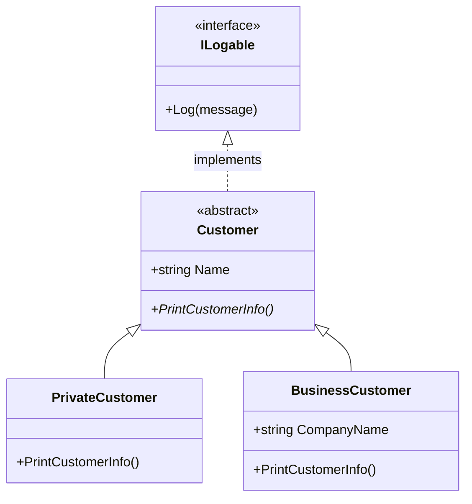

# 14_AbstractClasses: Abstrakte Klassen & Interfaces

## 📚 Theorie

### 1. Abstrakte Klassen
Eine Klasse, die **nicht instanziiert** werden kann (`new Tier()` geht nicht, wenn `Tier` abstrakt ist). Sie dient als Basis für andere Klassen.
*   **Abstrakte Methoden**: Haben keinen Code (`{ }`), sondern nur eine Signatur. Subklassen **müssen** diese mit `override` implementieren.
*   **Zweck**: Sicherstellen, dass alle Subklassen eine bestimmte Funktionalität bereitstellen.

### 2. Interfaces (Schnittstellen)
Ein Vertrag, der definiert, *was* eine Klasse können muss (z.B. `ILogable` -> muss `Log()` haben).
*   Enthält nur Methodensignaturen (vor C# 8).
*   Eine Klasse kann **mehrere** Interfaces implementieren (aber nur von **einer** Klasse erben).
*   **Wichtig**: Interfaces haben keine Felder (Variablen)!

### 3. Polymorphie (Vielgestaltigkeit)
Das Prinzip, dass ein Objekt sich je nach Betrachtungsweise anders verhält.
*   Wenn ich `tier.LautGeben()` aufrufe, bellt der Hund und miaut die Katze, obwohl beide als `Tier` gespeichert sind.
*   Das funktioniert durch **Late Binding** (Entscheidung zur Laufzeit) bei `virtual`/`abstract` und `override`.

---

## 📝 Aufgabenstellung
> [!NOTE]
> Quelle: `10 Einführung in die OOP mit C# - Teil 4 - 202601.pdf` (Tom Selig, BITLC)

### Aufgabe 1: Customer Hierarchie
*   **Abstrakte Klasse**: `Customer` mit Methode `PrintCustomerInfo()` (abstrakt).
*   **Subklasse**: `PrivateCustomer` (gibt "Private: Name" aus).
*   **Subklasse**: `BusinessCustomer` (gibt "Business: Name (Firma)" aus).

### Aufgabe 2: ILogable
*   Interface `ILogable` mit Methode `Log(string message)`.
*   Implementieren Sie es in den Customer-Klassen.

---

## 📐 UML-Klassendiagramm

