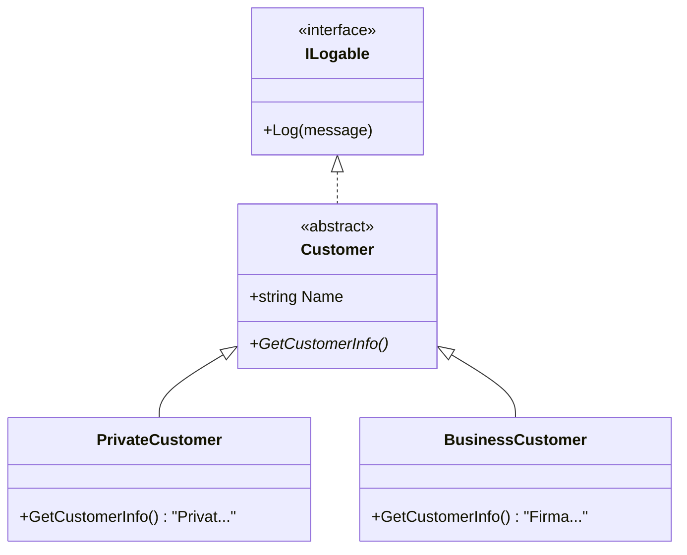

[⬅️ Zurück zum Hauptverzeichnis](../README.md)

# 14 - Abstrakte Klassen & Interfaces

## 💡 Theorie
Polymorphie (Vielgestaltigkeit) ist das Herz der OOP.
Wir nutzen **Abstraktion**, um Verträge zu definieren.

### Abstrakte Klasse vs. Interface
| Feature | Abstrakte Klasse (`abstract class`) | Interface (`interface`) |
| --- | --- | --- |
| **Code** | Kann Code enthalten (`Log()`). | Enthält (meist) nur Signaturen. |
| **Felder** | Kann Variablen haben (`Name`). | Keine Variablen erlaubt. |
| **Vererbung** | Eine Klasse erbt von **einer** Klasse. | Eine Klasse kann **viele** Interfaces haben. |
| **Zweck** | Gemeinsame Basis (Is-A). | Fähigkeit (Can-Do). |

## 📝 Aufgabenstellung
1.  **Customer (Abstract)**: Basis für alle Kunden. Definiert `GetCustomerInfo()` (abstrakt).
2.  **Private/BusinessCustomer**: Implementieren die Info-Methode spezifisch.
3.  **ILogable (Interface)**: Definiert `Log()`. Alle Kunden können loggen.

## 🧩 UML Klassendiagramm

## ✅ Definition of Done
- [ ] `Customer` ist abstrakt und hat `abstract`-Methoden.
- [ ] `ILogable` wird genutzt.
- [ ] Tests prüfen die korrekte Ausgabe der Subklassen.
