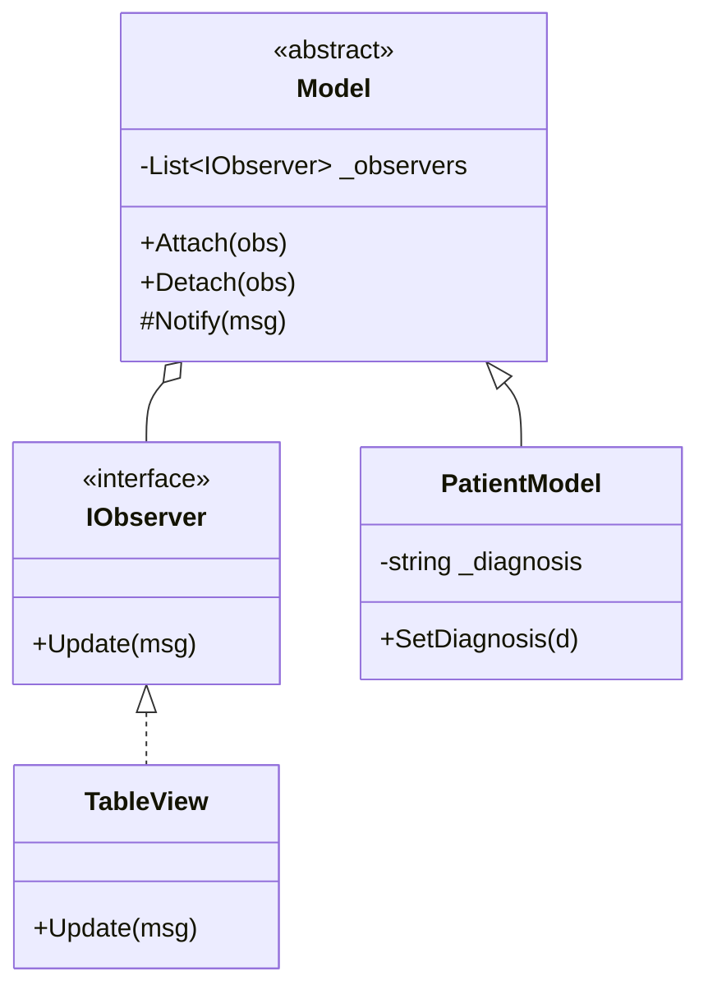

[⬅️ Zurück zum Hauptverzeichnis](../README.md)

# 15 - Klausur Lösungen (Probe)

## 📝 Übersicht
Lösungsvorschläge für die Probe-Klausur "OOP" (Jan 2026).
Enthält Code-Implementierungen für Klassendiagramme und Design Patterns.

## 🧑‍💻 Code Teil 1: Klassendiagramm

### 1. Klasse `Film`
Einfache Datenklasse mit Kapselung.
- `private` Felder (`_title`, `_duration`...).
- `public` Methode `GetInfo()`.

### 2. Observer Pattern (Beobachter)
Verhaltensmuster für 1:n Beziehungen (Wenn sich einer ändert, erfahren es alle).

- **IObserver**: Schnittstelle für Zuhörer (`Update()`).
- **Model (Subject)**: Verwaltet Liste von Observern (`Attach`, `Detach`, `Notify`).
- **PatientModel**: Konkretes Subject. Ruft `Notify` wenn sich Diagnose ändert.
- **TableView**: Konkreter Observer. Gibt Diagnose auf Konsole aus.

## 🧩 UML Diagramm (Observer)

## ✅ Definition of Done
- [ ] `Film` Klasse erstellt und getestet.
- [ ] Observer Pattern vollständig implementiert (Subject + Observer).
- [ ] Tests prüfen `Attach`, `Detach` und `Notify`.
