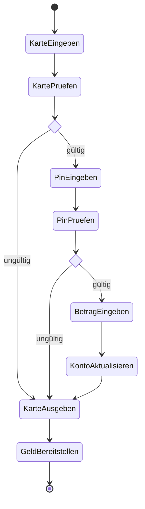
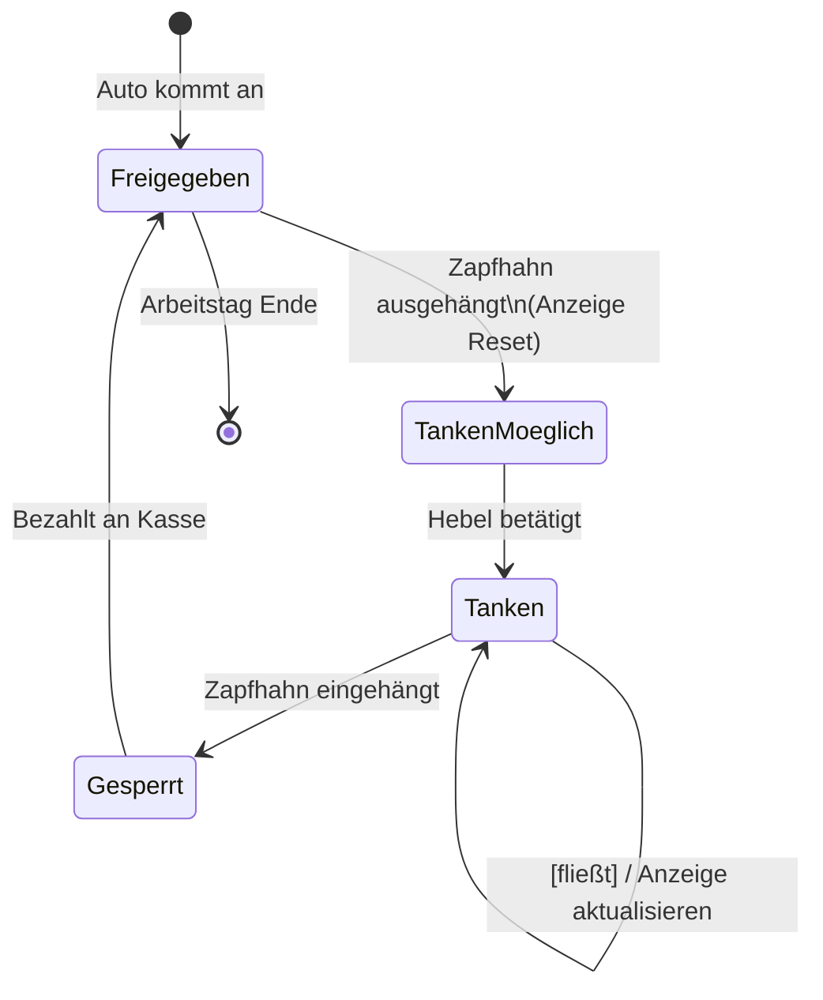
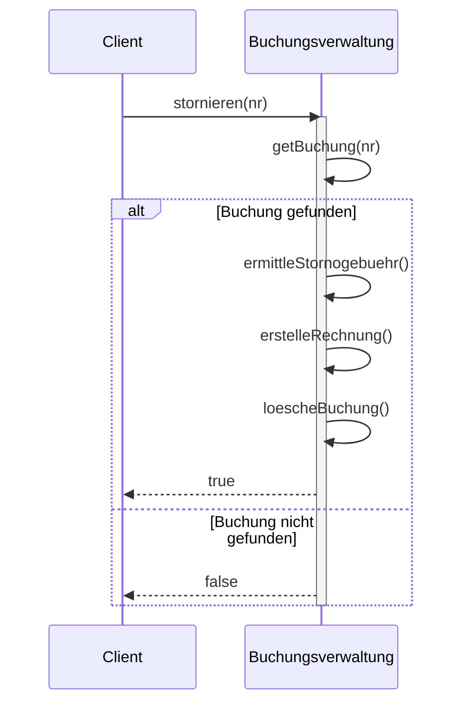

# 15_Klausur: Probe-Klausur Lösungen

Diese Unit enthält die programmtechnische Lösung der Probe-Klausur sowie die UML-Lösungen.

> [!NOTE]
> Quelle: `Klausur OOP 20260119 Probe.pdf` (Tom Selig, BITLC)

---

## 🎬 Teil 1: Klassendiagramm (Code)

### Aufgabe 1: Klasse `Film`
Implementierung siehe `src/Film.cs`.
*   Kapselung: `private` Felder, `public` Properties/Methoden.
*   Konstruktor initialisiert alle Felder.

### Aufgabe 2: Observer Pattern
Implementierung siehe `src/Observer/`.
*   **Abstract Subject**: `Model` (verwaltet Liste von Observern).
*   **Interface**: `IObserver` (definiert `Update()`).
*   **Concrete Subject**: `PatientModel` (ruft `NotifyObservers` bei Änderung).
*   **Concrete Observer**: `TableView` (registriert sich und reagiert auf Updates).

---

## 📊 Teil 2: Anwendungsfalldiagramm (Use Case)

**Szenario**: Versicherungsgesellschaft "Knall & Peng AG".

```mermaid
usecaseDiagram
    actor "Fahrzeughalter" as FH
    actor "Sachbearbeiter" as SB

    package "Versicherungssystem" {
        usecase "Vertrag abschließen" as UC1
        usecase "Prämie zahlen" as UC2
        usecase "Konditionen ändern" as UC3
        usecase "Versicherung kündigen" as UC4
        usecase "Schaden melden" as UC5
        usecase "Schaden bearbeiten" as UC6
    }

    FH --> UC1
    SB --> UC1
    FH --> UC2
    SB --> UC3
    FH --> UC4
    SB --> UC4
    FH --> UC5
    UC5 <.. UC6 : <<include>>
    SB --> UC6
```

---

## 🏃 Teil 3: Aktivitätsdiagramm

**Szenario**: Geld abheben am Automaten.



---

## 🚦 Teil 4: Zustandsdiagramm

**Szenario**: Zapfsäule.



---

## 📞 Teil 5: Sequenzdiagramm

**Szenario**: Stornierung Buchung.


