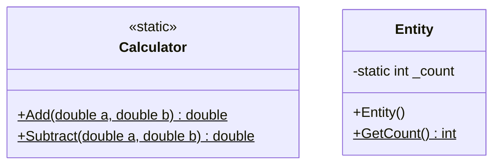

# 16_StaticMembers: Statische Member

## 📚 Theorie

### 1. `static` Keyword
Das Schlüsselwort `static` bedeutet, dass ein Member (Feld, Methode, Property) zur **Klasse selbst** gehört und nicht zu einer spezifischen Instanz (Objekt).

### 2. Statische Felder
*   Werden von allen Instanzen der Klasse geteilt.
*   Gibt es nur **einmal** im Speicher.
*   Beispiel: `InstanzZähler`, Konfigurationswerte.

```csharp
public class Auto {
    public static int AnzahlAutos = 0;
    public Auto() { AnzahlAutos++; }
}
```

### 3. Statische Methoden
*   Können aufgerufen werden, ohne ein Objekt zu erzeugen: `Math.Sqrt(9)`.
*   Können **nur** auf andere statische Member zugreifen (kein `this`!).
*   Beispiel: Hilfsfunktionen, `Main`-Methode.

### 4. Statische Klassen
*   Können **nur** statische Member enthalten.
*   Können nicht instanziiert werden.
*   Beispiel: `System.Math`, `System.Console`.

---

## 📝 Aufgabenstellung
> [!NOTE]
> Quelle: Legacy `Aufgabe_04_Static_Member`

1.  **Calculator**: Eine rein statische Klasse für Rechenoperationen (`Add`, `Sub`, `Mult`, `Div`).
2.  **Entity**: Eine Klasse, die mitzählt, wie viele Instanzen von ihr erzeugt wurden (`InstanceCount`).

---

## 📐 UML-Klassendiagramm


