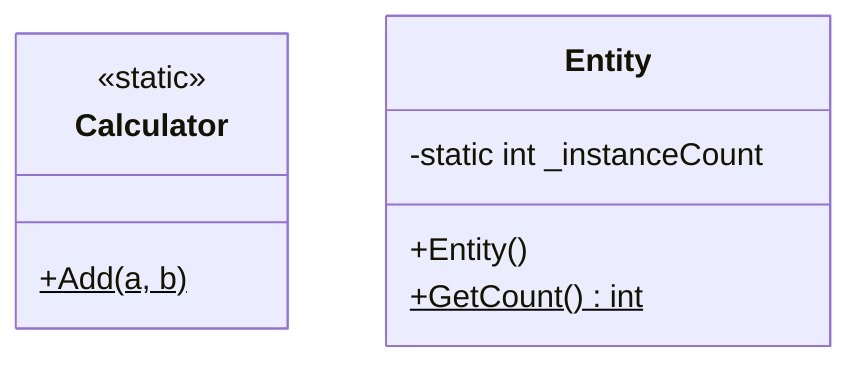

[⬅️ Zurück zum Hauptverzeichnis](../README.md)

# 16 - Statische Member

## 💡 Theorie
`static` trennt Daten vom Objekt. Sie gehören zur **Klasse**.

### Unterschiede
| Instanz (Normal) | Statisch (`static`) |
| --- | --- |
| existiert pro `new Object()` | existiert **einmal** pro App |
| Zugriff über Variable (`obj.Feld`) | Zugriff über Klassenname (`Klasse.Feld`) |
| `this` verfügbar | `this` **nicht** verfügbar |

### Wann nutzen?
- **Utility Funktionen**: `Math.Pow()`, `Calculator.Add()`
- **Globale Zähler**: `NextId`
- **Konstanten**: `Math.PI`

## 📝 Aufgabenstellung
1.  `Calculator`: Statische Klasse für Mathe.
2.  `Entity`: Normale Klasse mit statischem Feld `_instanceCount`.

## 🧩 UML Klassendiagramm

## ✅ Definition of Done
- [ ] `Calculator` ist `static class` und instanziierbar (Compiler Fehler wenn `new`).
- [ ] `Entity` zählt Instanzen global hoch.
- [ ] Tests bestätigen, dass `_instanceCount` geteilt wird.
