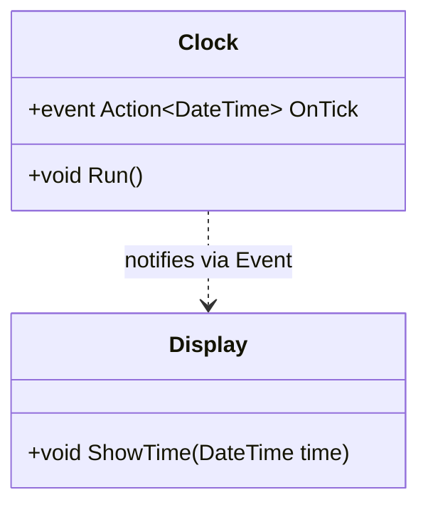

# 17_DelegatesEvents: Delegates & Events

## 📚 Theorie

### 1. Delegates
Ein Delegate ist ein Datentyp, der eine **Referenz auf eine Methode** speichert. Es ist wie ein "Funktionszeiger".
*   Ermöglicht es, Methoden als Parameter zu übergeben.
*   Basis für Events und LINQ.

```csharp
public delegate void MyDelegate(string msg);
MyDelegate del = Console.WriteLine;
del("Hallo!"); // Ruft Console.WriteLine("Hallo!") auf
```

### 2. Events
Ein Event ist ein spezieller Delegate, der den **Beobachter-Entwurfsmuster** (Observer Pattern) in C# integriert.
*   Andere Klassen können sich mit `+=` registrieren (abonnieren).
*   Das Objekt, das das Event besitzt, kann es auslösen (feuern).

```csharp
public event EventHandler MyEvent;
```

---

## 📝 Aufgabenstellung
> [!NOTE]
> Quelle: Legacy `Aufgabe_21_Delegate`, `Aufgabe_21_Delegates-Events`

1.  **Delegate**: Einfache Demo, wie man Methoden zuweist und aufruft.
2.  **Clock (Event)**: Eine Klasse, die jede Sekunde ein Event feuert (simuliert), und ein `Display`, das darauf reagiert.

---

## 📐 UML-Klassendiagramm


