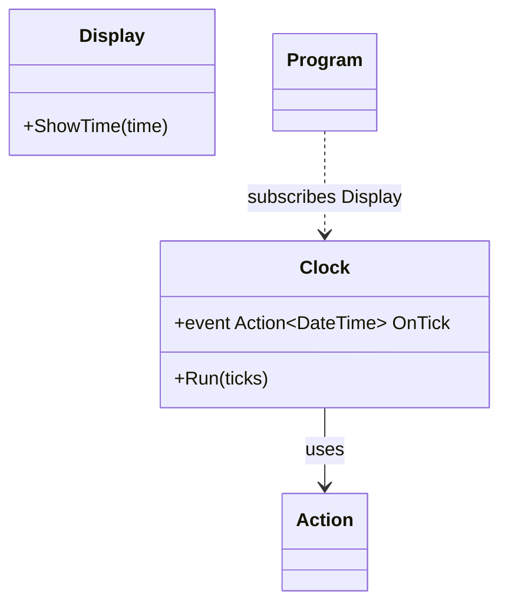

[⬅️ Zurück zum Hauptverzeichnis](../README.md)

# 17 - Delegates & Events

## 💡 Theorie
Delegates sind **Methoden-Zeiger**. Sie erlauben es, Code in Variablen zu speichern und herumzureichen.

### 1. Delegate (Typ)
```csharp
public delegate void MeinDelegate(string s);
MeinDelegate d = Console.WriteLine;
d("Hallo");
```

### 2. Event (Mechanismus)
Ein Event ist ein Delegate mit integriertem Schutz (Observer Pattern).
- `+=`: Abonnieren
- `-=`: De-Abonnieren
- Nur der Besitzer darf es auslösen (`Invoke`).

### 3. Action & Func
Moderne C# Shortcuts für Delegates:
- `Action<T>`: Methode mit Rückgabetyp `void`.
- `Func<T, R>`: Methode mit Rückgabetyp `R`.

## 📝 Aufgabenstellung
1.  **Clock**: Eine Uhr, die tickt (`OnTick`).
2.  **Display**: Zeigt die Uhrzeit an, wenn es tickt.

## 🧩 UML Klassendiagramm



## ✅ Definition of Done
- [ ] `Clock` feuert Event `OnTick`.
- [ ] `Display` reagiert darauf.
- [ ] Tests prüfen, ob das Event wirklich ausgelöst wird.
