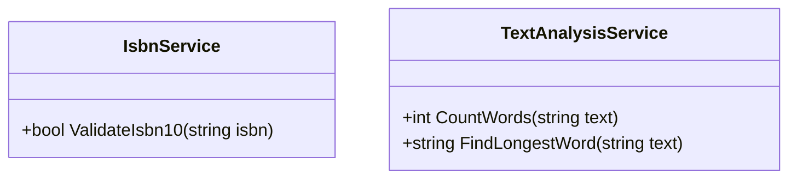

# 18_Algorithms: Algorithmen

## 📚 Theorie

Diese Unit behandelt grundlegende algorithmische Probleme und String-Manipulation.

### 1. ISBN-10 Validierung
Eine ISBN-10 (International Standard Book Number, vor 2007) besteht aus 9 Ziffern und einer Prüfziffer.
*   **Formel**: `(z1*1 + z2*2 + ... + z9*9) % 11 == z10`
*   Die Prüfziffer `z10` kann '0'-'9' oder 'X' (für 10) sein.

### 2. Textanalyse (Trapattoni)
Analyse eines Textes (z.B. die berühmte Wutrede von Giovanni Trapattoni).
*   Wörtern zählen.
*   Satzzeichen filtern.
*   Wortlängen analysieren.

---

## 📝 Aufgabenstellung
> [!NOTE]
> Quelle: Legacy `Aufgabe_19_ISBN`, `Aufgabe_20_TrapattoniAnalysis`

1.  **IsbnService**: Implementieren Sie eine Methode `ValidateIsbn10(string isbn)`, die `true` oder `false` zurückgibt.
2.  **TextAnalysisService**: Implementieren Sie Methoden, um einen Text zu analysieren (`CountWords`, `FindLongestWord`).

---

## 📐 UML-Klassendiagramm

