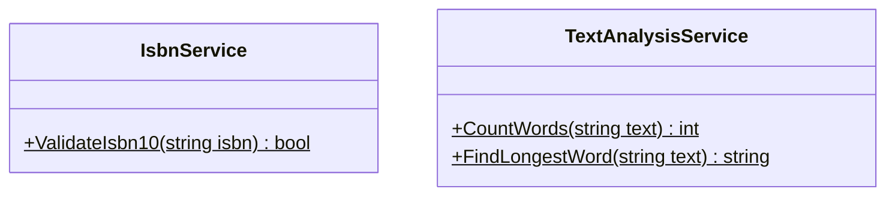

[⬅️ Zurück zum Hauptverzeichnis](../README.md)

# 18 - Algorithmen

## 💡 Theorie
Algorithmisches Denken in C#:
- Probleme zerlegen.
- Strings manipulieren (`Split`, `Trim`).
- Mathematische Prüfungen (Modulo `%`).

## 📝 Aufgabenstellung
### 1. ISBN-10 Validierung
Überprüfen Sie, ob eine ISBN gültig ist.
- Formel: `(z1*1 + ... + z9*9) % 11 == z10`
- Besonderheit: `X` als Prüfziffer (Wert 10).

### 2. Textanalyse
Einen Text zerlegen und analysieren.
- Anzahl Wörter.
- Längstes Wort finden.
- Robustheit gegen Leerzeichen.

## 🧩 UML Klassendiagramm

## ✅ Definition of Done
- [ ] `ValidateIsbn10` erkennt gültige/ungültige ISBNs.
- [ ] `TextAnalysisService` handhabt Mehrfach-Leerzeichen korrekt.
- [ ] Tests decken Grenzfälle ab.
