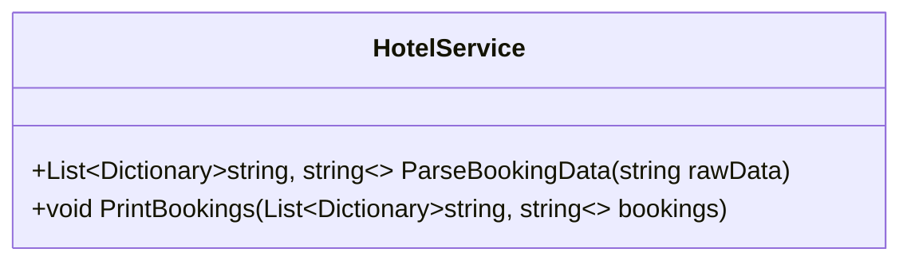

# 19_Collections: Generische Listen & Dictionaries

## 📚 Theorie

### 1. `List<T>`
Eine dynamische Liste, die wächst und schrumpft.
*   **Zugriff**: Per Index `liste[0]`.
*   **Methoden**: `Add()`, `Remove()`, `Contains()`, `Sort()`.
*   **Unterschied zu Array**: Arrays haben feste Größe, Listen sind dynamisch.

### 2. `Dictionary<TKey, TValue>`
Ein Speicher für Schlüssel-Wert-Paare (Key-Value-Pairs).
*   **Zugriff**: Per Key `dict["MeinKey"]`.
*   **Performance**: Sehr schnell (O(1)) beim Suchen nach Keys.
*   **Beispiel**: Telefonbuch (Name -> Nummer), Hotelzimmer (ZimmerNr -> Gast).

### 3. `Queue<T>` und `Stack<T>`
*   **Queue (Warteschlange)**: FIFO (First In, First Out). Wer zuerst kommt, mahlt zuerst.
*   **Stack (Stapel)**: LIFO (Last In, First Out). Das zuletzt aufgelegte Element wird als erstes wieder weggenommen.

---

## 📝 Aufgabenstellung
> [!NOTE]
> Quelle: `Aufgabe Hotel.pdf`

Wir simulieren ein einfaches Hotel-Verwaltungssystem.
Gegeben ist ein langer String mit Buchungsdaten: `15;D;Peter Schmidt;Wuppertal\n...`.

**Aufgabe**:
1.  Zerlegen Sie den String (Parsing).
2.  Speichern Sie jeden Gast in einem `Dictionary<string, string>` (z.B. "Zimmer" -> "15").
3.  Speichern Sie alle Gäste in einer `List<Dictionary<string, string>>`.
4.  Geben Sie die Liste formatiert aus.

---

## 📐 UML-Klassendiagramm

