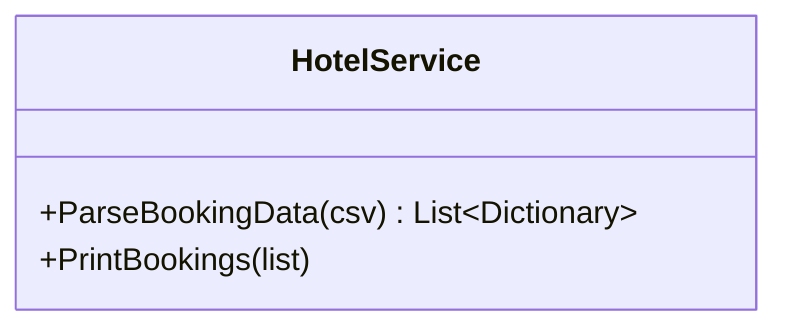

[⬅️ Zurück zum Hauptverzeichnis](../README.md)

# 19 - Generische Listen & Dictionaries

## 💡 Theorie
Die moderne Art, Daten zu speichern. Array war gestern.
- **List<T>**: Dynamisches Array.
- **Dictionary<K, V>**: Schnelle Suche per Schlüssel.

### Wichtige Methoden
```csharp
list.Add(item);
list.Remove(item);
var item = list[0];

dict.Add("Key", "Value");
if (dict.ContainsKey("Key")) { ... }
var val = dict["Key"];
```

## 📝 Aufgabenstellung
**Hotel-Verwaltung**:
Daten kommen als CSV (`"101;Single;Name;City"`) und sollen strukturiert werden.
1.  **Parsing**: String zerlegen.
2.  **Mapping**: Jeden Gast in ein `Dictionary` packen.
3.  **Collection**: Alle Gäste in einer `List` speichern.

## 🧩 UML Klassendiagramm



## ✅ Definition of Done
- [ ] CSV-String wird korrekt in Objekte zerlegt.
- [ ] `Dictionary` speichert Eigenschaften (Zimmer, Name, Stadt).
- [ ] `List` hält alle Dictionary-Objekte.
- [ ] Tests prüfen die Anzahl und Inhalte der Einträge.
