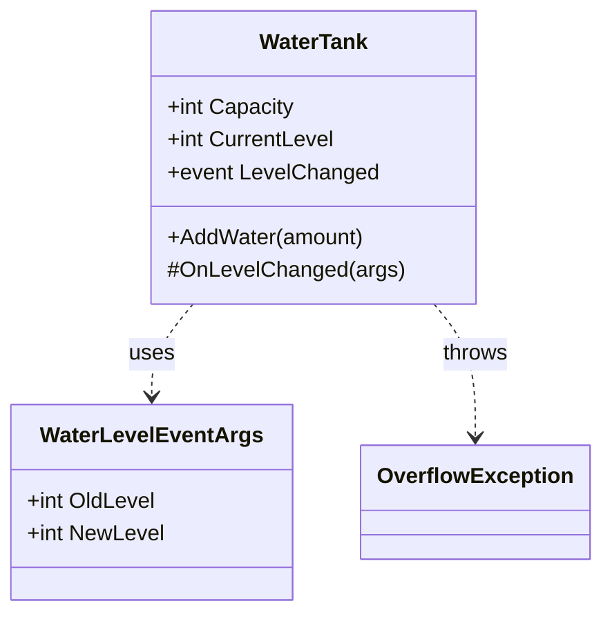

[⬅️ Zurück zum Hauptverzeichnis](../README.md)

# 20 - Events & Exceptions

## 💡 Theorie
Robuste Anwendungen brauchen Fehlerbehandlung und Kommunikation.

### Exception Handling
- `try-catch`: Fängt Fehler ab, damit die App nicht abstürzt.
- `throw`: Signalisert, dass etwas schiefgelaufen ist (z.B. `OverflowException`).
- `finally`: Wird immer ausgeführt (Aufräumen).

### Custom Events (`EventHandler<T>`)
Events erlauben Klassen, Nachrichten zu senden.
1.  **EventArgs**: Container für Daten (`OldLevel`, `NewLevel`).
2.  **Event**: Die "Glocke" (`public event EventHandler<MyArgs> Name`).
3.  **Invoke**: Das Läuten (`Name?.Invoke(this, args)`).

## 📝 Aufgabenstellung
**WaterTank Simulation**:
- Tank hat Kapazität.
- Beim Füllen (`AddWater`):
    - Wenn voll -> `OverflowException`.
    - Wenn Level ändert -> `LevelChanged` Event.

## 🧩 UML Klassendiagramm

## ✅ Definition of Done
- [ ] `AddWater` wirft Fehler bei Überlauf.
- [ ] `LevelChanged` feuert nur bei echter Änderung.
- [ ] `try-catch` Block im Programm fängt den Fehler sauber ab.
