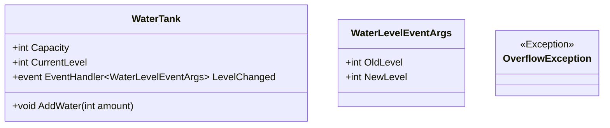

# 20_EventsExceptions: Events & Exceptions

## 📚 Theorie

### 1. Exceptions (Ausnahmen)
Fehlerbehandlung zur Laufzeit.
*   `try`: Block, in dem ein Fehler auftreten könnte.
*   `catch`: Block, der den Fehler abfängt.
*   `throw`: Wirft einen Fehler manuell.
*   `finally`: Wird immer ausgeführt (z.B. zum Aufräumen).

### 2. Benutzerdefinierte Events
Erweiterte Events mit `EventHandler<T>`.
*   Ermöglicht das Übergeben von Daten (EventArgs) an den Empfänger.
*   Standard-Pattern in .NET.

---

## 📝 Aufgabenstellung
> [!NOTE]
> Quelle: `Aufgabe Wasserstand 1 & 2`

Wir simulieren einen Wassertank (`WaterTank`).
1.  Der Tank hat eine Kapazität und einen aktuellen Füllstand.
2.  Methode `AddWater(int amount)`:
    *   Fügt Wasser hinzu.
    *   Wenn der Tank überläuft -> `OverflowException` werfen!
    *   Wenn sich der Füllstand ändert -> `LevelChanged` Event feuern.
3.  Das Event soll die alte und neue Füllmenge übermitteln (`WaterLevelEventArgs`).

---

## 📐 UML-Klassendiagramm

