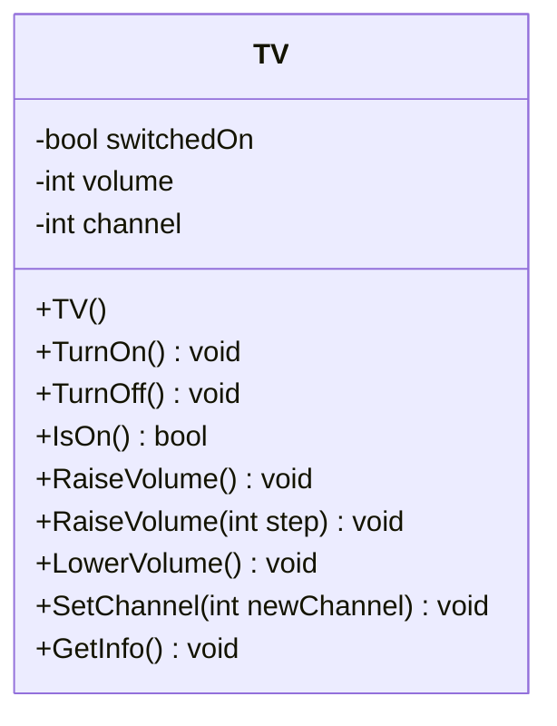

```mermaid
classDiagram
    class TV {
        %% Attribute (private)
        -bool switchedOn
        -int volume
        -int channel

        %% Konstruktor
        +TV()

        %% Methoden (public)
        +TurnOn() void
        +TurnOff() void
        +IsOn() bool
        +RaiseVolume() void
        +RaiseVolume(int step) void
        +LowerVolume() void
        +SetChannel(int newChannel) void
        +GetInfo() void
    }
```