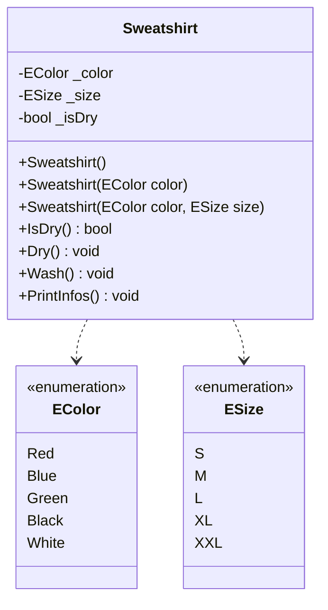

# Klassendiagramm - Aufgabe 03

```mermaid
classDiagram
  class EColor {
    <<enumeration>>
    Red
    Blue
    Green
    Black
    White
  }

  class ESize {
    <<enumeration>>
    S
    M
    L
    XL
    XXL
  }

  class Sweatshirt {
    -EColor _color
    -ESize _size
    -bool _isDry

    +Sweatshirt()
    +Sweatshirt(EColor color)
    +Sweatshirt(EColor color, ESize size)
    +IsDry() bool
    +Dry() void
    +Wash() void
    +PrintInfos() void
  }

  Sweatshirt ..> EColor
  Sweatshirt ..> ESize
```
