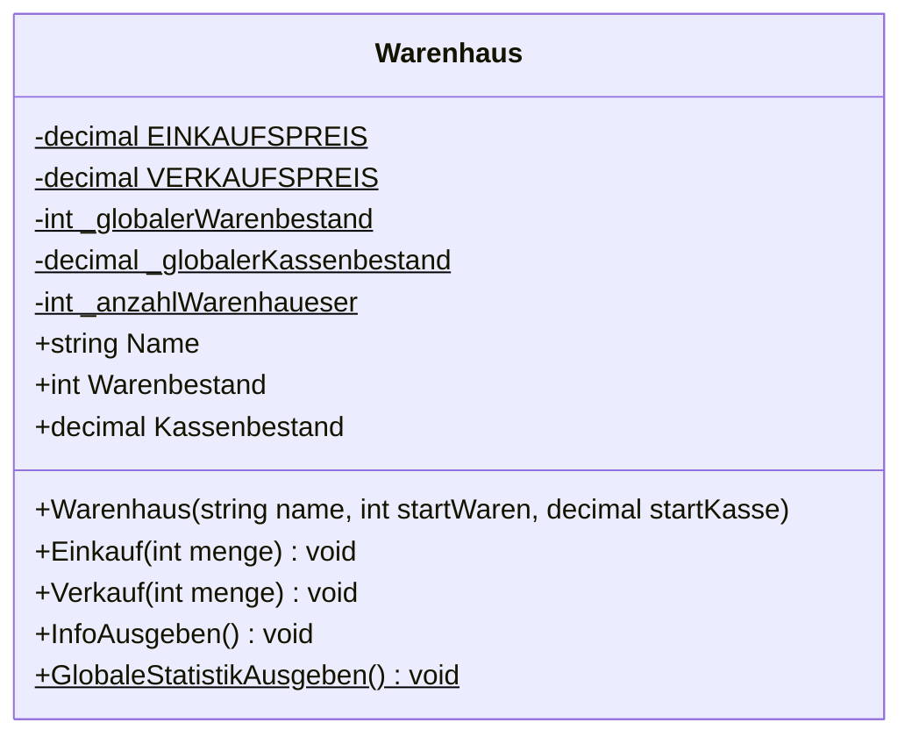

# Klassendiagramm - Aufgabe 04

```mermaid
classDiagram
    class Warenhaus {
        -decimal EINKAUFSPREIS$
        -decimal VERKAUFSPREIS$
        
        -int _globalerWarenbestand$
        -decimal _globalerKassenbestand$
        -int _anzahlWarenhaueser$

        +string Name
        +int Warenbestand
        +decimal Kassenbestand

        +Warenhaus(string name, int startWaren, decimal startKasse)
        +Einkauf(int menge) void
        +Verkauf(int menge) void
        +InfoAusgeben() void
        
        +GlobaleStatistikAusgeben()$ void
    }
```
> **Hinweis**: Mit `$` markierte Member sind `static`.
