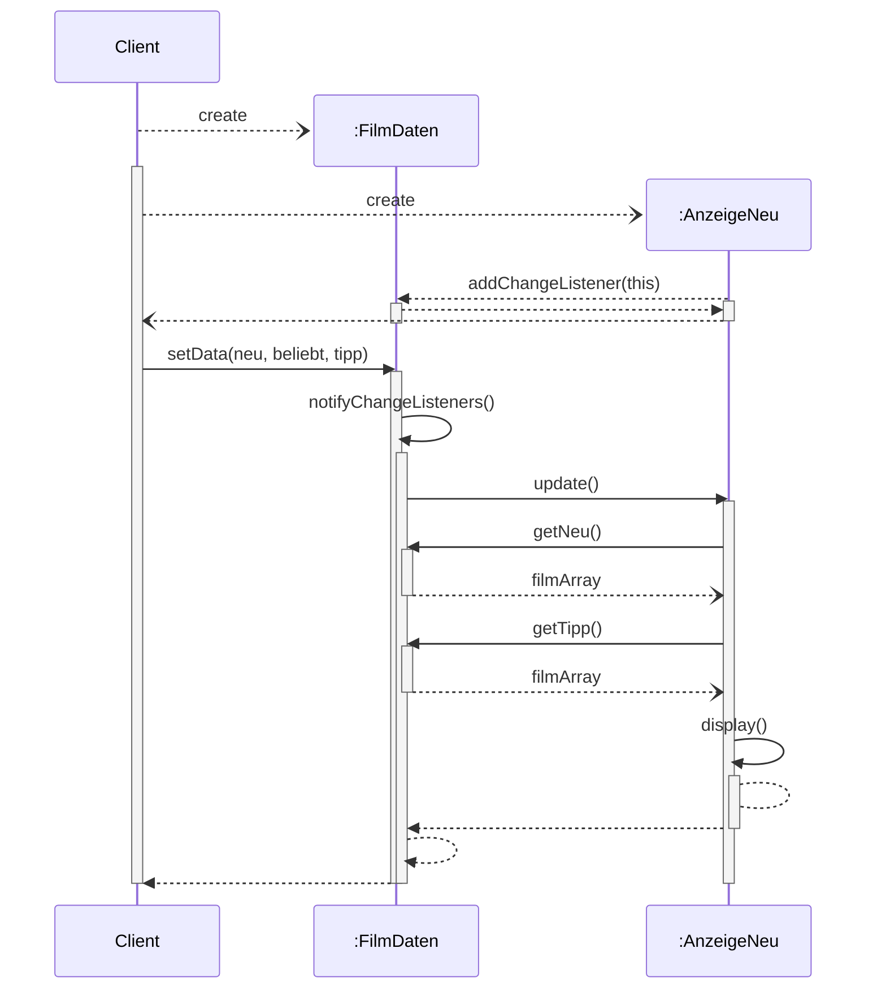

```mermaid
sequenceDiagram
    participant C as Client
    create participant F as :FilmDaten
        C--)F: create
    activate C

    create participant A as :AnzeigeNeu
    C--)A: create
    
    
    A-->>F: addChangeListener(this)
    activate A
    activate F
    F-->>A:
    deactivate F
    A--)C:
    deactivate A
    C->>F: setData(neu, beliebt, tipp)
    activate F
    F->>F: notifyChangeListeners()
    activate F
    F->>A: update()
    activate A
    A->>F: getNeu()
    activate F
    F--)A: filmArray
    deactivate F
    A->>F: getTipp()
    activate F
    F--)A: filmArray
    deactivate F
    A->>A: display()
    activate A
    A-->A:
    
    %% Rückkehr des Kontrollflusses
    A-->>F: 
    deactivate A
    F-->>F: 
    F-->>C: 
    deactivate A
    deactivate F
    deactivate F
    deactivate C
```
