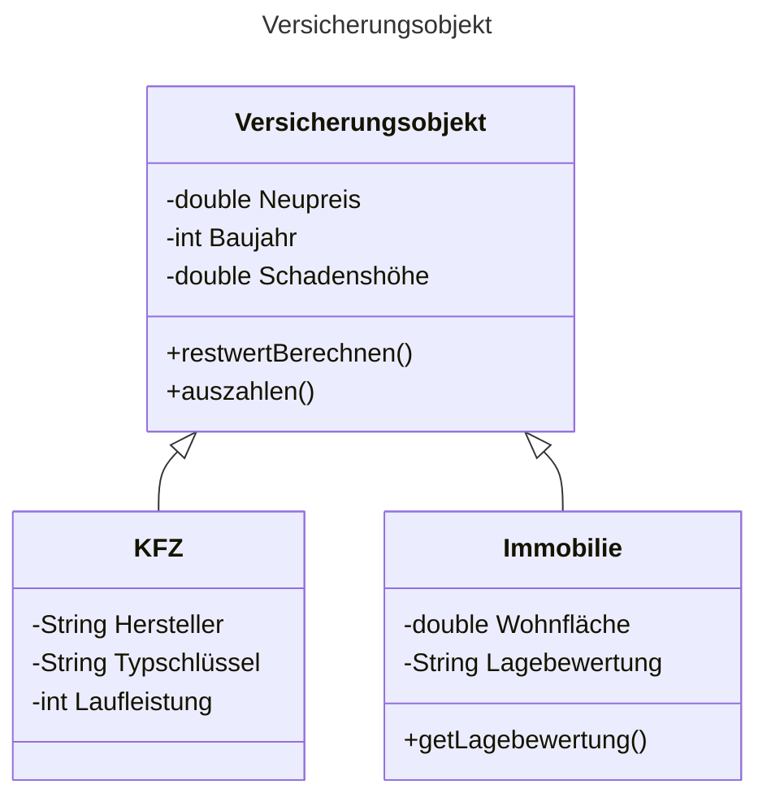

```mermaid
---
title: Versicherungsobjekt
---
classDiagram
%% Oberklasse mit Gemeinsamkeiten
    class Versicherungsobjekt {
        -double Neupreis
        -int Baujahr
        -double Schadenshöhe
        +restwertBerechnen()
        +auszahlen()
    }

    %% Unterklasse KFZ
    class KFZ {
        -String Hersteller
        -String Typschlüssel
        -int Laufleistung
    }

    %% Unterklasse Immobilie
    class Immobilie {
        -double Wohnfläche
        -String Lagebewertung
        +getLagebewertung()
    }

    %% Vererbungsbeziehungen (Pfeil zeigt zum Elternteil)
    Versicherungsobjekt <|-- KFZ
    Versicherungsobjekt <|-- Immobilie
```
