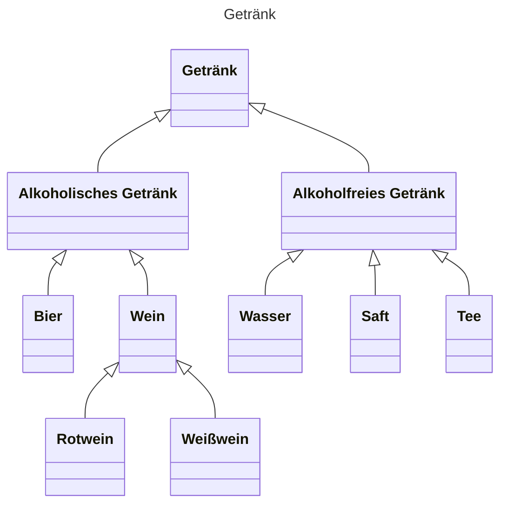

```mermaid
---
title: Getränk
---
classDiagram
    %% Oberklasse
    class Getränk

    %% 1. Ebene: Unterscheidung Alkohol
    class AlkoholischesGetränk["Alkoholisches Getränk"]
    class AlkoholfreiesGetränk["Alkoholfreies Getränk"]

    Getränk <|-- AlkoholischesGetränk
    Getränk <|-- AlkoholfreiesGetränk

    %% 2. Ebene: Konkrete Getränke & Zwischenstufen
    class Bier
    class Wein
    class Wasser
    class Saft
    class Tee

    AlkoholischesGetränk <|-- Bier
    AlkoholischesGetränk <|-- Wein

    AlkoholfreiesGetränk <|-- Wasser
    AlkoholfreiesGetränk <|-- Saft
    AlkoholfreiesGetränk <|-- Tee

    %% 3. Ebene: Weinsorten
    class Rotwein
    class Weißwein

    Wein <|-- Rotwein
    Wein <|-- Weißwein
```
