# 🎓 IHK Prüfungsvorbereitung: OOP & UML Cheatsheet
*> "Kurz, knackig, klausurrelevant."*

---

## 1. UML - Die "Big 5" (Cheatsheet)

### Übersicht
| Diagrammtyp | Zweck | Wichtigste Symbole |
| :--- | :--- | :--- |
| **Klassendiagramm** | Statische Struktur, Beziehungen, Attribute/Methoden | Klassen, Interfaces, Assoziationen, Vererbung |
| **Anwendungsfalldiagramm** | Wer macht was? Systemgrenzen & Funktionalitäten | Akteure, Use Cases, Systemgrenze, Beziehungen |
| **Aktivitätsdiagramm** | Ablauf von Prozessen, Algorithmen, Geschäftslogik | Start/Ende, Aktion, Entscheidung, Gabelung (Fork) |
| **Zustandsdiagramm** | Lebenszyklus eines Objekts (z.B. Bestellung) | Zustand, Transition, Start/Ende |
| **Sequenzdiagramm** | Zeitlicher Ablauf von Nachrichten zwischen Objekten | Lebenslinien, Nachrichten (synch/asynch), Fragmente |

---

### 1.1 Klassendiagramm (Class Diagram)
**Fokus:** Statischer Bauplan der Software.

```mermaid
classDiagram
    %% Beziehungen
    Fahrzeug <|-- Auto : Vererbung (Ist-ein)
    Auto *-- Motor : Komposition (Existenzabhängig)
    Auto o-- Radio : Aggregation (Kann auch ohne existieren)
    Fahrer --> Auto : Assoziation (Nutzt)
    
    class Fahrzeug {
        # string marke
        + fahren()
    }
    
    class Auto {
        - int ps
        + hupen()
    }
    
    class Fahrer {
        + name : string
    }
    
    %% Notiz für Interfaces
    class IBewegbar {
        <<interface>>
        + bewegen()
    }
    IBewegbar <|.. Auto : Realisierung
```


> **⚠️ Stolperfallen:**
> *   **Sichtbarkeiten:** `+` Public, `-` Private, `#` Protected. **Nicht vergessen!**
> *   **Rauten:** **Gefüllt** (Komposition) = "Teil stirbt mit dem Ganzen" (Haus & Zimmer). **Leer** (Aggregation) = "Teil überlebt" (Ehepartner & Ehe).
> *   **Pfeilspitzen:** Geschlossenes Dreieck = Vererbung. Offenes Dreieck/Pfeil = Assoziation.

---

### 1.2 Anwendungsfalldiagramm (Use Case Diagram)
**Fokus:** Was kann das System? (Aus Nutzersicht).

```mermaid
usecaseDiagram
    actor "Kunde" as K
    actor "Admin" as A
    
    package "Online Shop System" {
        usecase "Artikel suchen" as UC1
        usecase "Bestellen" as UC2
        usecase "Login" as UC3
        usecase "Rabatt prüfen" as UC4
    }
    
    %% Beziehungen
    K --> UC1
    K --> UC2
    A --> UC3
    
    %% Include vs Extend
    UC2 ..> UC3 : <<include>> \n(Muss eingeloggt sein)
    UC2 <.. UC4 : <<extend>> \n(Nur wenn Gutschein vorhanden)
```
> **⚠️ Stolperfallen:**
> *   **Include:** "Wird **immer** mit ausgeführt" (z.B. Login beim Bestellen).
> *   **Extend:** "Kann **optional** passieren" (z.B. Fehlermeldung anzeigen, Rabatt anwenden).
> *   **Systemgrenze:** Rechteck um die Use Cases ziehen! Akteure stehen **außen**.

---

### 1.3 Aktivitätsdiagramm (Activity Diagram)
**Fokus:** Wie läuft ein Prozess ab? (Flussdiagramm ++).

```mermaid
flowchart TD
    Start((Start)) --> A[Ware scannen]
    A --> B{Preis > 50€?}
    
    %% Entscheidung
    B -- Ja --> C[Rabatt abziehen]
    B -- Nein --> D[Normalpreis berechnen]
    
    %% Zusammenführung
    C --> E
    D --> E[Rechnung drucken]
    
    %% Fork (Parallel)
    E --> F1===
    F1=== --> G[Lagerbestand -1]
    F1=== --> H[Kunde benachrichtigen]
    
    %% Join (Warten auf beide)
    G --> I2===
    H --> I2===
    I2=== --> Ende(((Ende)))
```
> **⚠️ Stolperfallen:**
> *   **Gabelung (Fork):** Ein Balken splittet in mehrere Pfade -> **Parallelität**.
> *   **Entscheidung (Raute):** Bedingungen an die Pfeile schreiben (Ja/Nein).
> *   Unterscheide **Aktion** (Rechteck mit runden Ecken) von **Objekt** (Rechteck).

---

### 1.4 Zustandsdiagramm (State Machine Diagram)
**Fokus:** Welche Zustände nimmt ein Objekt an?

```mermaid
stateDiagram-v2
    [*] --> Neu : Auftrag erstellt
    
    Neu --> InBearbeitung : Mitarbeiter beginnt
    InBearbeitung --> Versendet : Paket abgeholt
    
    %% Selbst-Transition / Internes Event
    InBearbeitung --> InBearbeitung : Status-Update Log
    
    Versendet --> [*] : Zugestellt
    
    state InBearbeitung {
        %% Entry/Do/Exit
        [*] --> Prüfen
        Prüfen --> Verpacken
    }
```


> **⚠️ Stolperfallen:**
> *   **Transitionen beschriften:** `Event [Bedingung] / Aktion`.
> *   **Start/Ende:** Schwarzer Punkt (Start), Umrandeter Punkt (Ende).

---

### 1.5 Sequenzdiagramm (Sequence Diagram)
**Fokus:** Wer redet wann mit wem?


> **⚠️ Stolperfallen:**
> *   **Lebenslinien:** Gestrichelt nach unten.
> *   **Aktivierungsbalken:** Zeigen, wie lange ein Objekt rechnet/aktiv ist.
> *   **Nachrichten:** Durchgezogen = Aufruf, Gestrichelt = Antwort (`return`).

---

## 2. OOP in C# (Deep Dive)

### Konzepte & Analogien
| Keyword / Konzept | Bedeutung | IHK-taugliche Analogie aus dem Alltag |
| :--- | :--- | :--- |
| **Klasse** | Bauplan für Objekte. | **Ausstechform** für Plätzchen. |
| **Objekt** | Konkrete Instanz. | Das **Plätzchen** selbst. |
| **Interface** | Vertrag: "Was muss es können?", aber nicht "Wie". | **Steckdose**: Egal ob Atom- oder Windstrom, der Stecker passt (Vertrag: liefert 230V). |
| **Abstrakte Klasse** | Basisklasse, von der keine Instanz erzeugt werden kann. | **Begriff "Säugetier"**: Du kannst kein "Säugetier" kaufen, nur einen Hund oder eine Katze. |
| **Polymorphie** | Gleicher Methodenname, unterschiedliches Verhalten. | **"Hupen"**: Ein Auto hupt laut, ein Fahrrad klingelt, ein Schiff trötet. Der Befehl ist gleich. |
| **Kapselung** | Daten verbergen, Zugriff nur kontrolliert erlauben. | **Geldautomat**: Du greifst nicht direkt in den Tresor, sondern nutzt das Tastenfeld. |
| **`static`** | Gehört der Klasse, nicht dem Objekt. | **Schwarzes Brett**: Eines für alle Schüler. (Nicht jeder hat sein eigenes). |

### Code: Vererbung & Polymorphie (Best Practice)
```csharp
// Abstraktion: Basisklasse definiert "Was" passiert
public abstract class Tier 
{
    public string Name { get; set; } // Kapselung (Property)

    public Tier(string name) { Name = name; } // Konstruktor

    // abstract: Muss überschrieben werden
    public abstract void MacheGeräusch();

    // virtual: Kann überschrieben werden (Standardverhalten existiert)
    public virtual void Schlafen() 
    {
        Console.WriteLine("Zzz...");
    }
}

public class Hund : Tier 
{
    public Hund(string name) : base(name) { } // `this` Kontext ist hier implizit für base

    public override void MacheGeräusch() 
    {
        Console.WriteLine("Wuff!");
    }
}

public class Katze : Tier 
{
    public Katze(string name) : base(name) { }

    public override void MacheGeräusch() 
    {
        Console.WriteLine("Miau!");
    }
    
    // Überschreibt optionales Verhalten
    public override void Schlafen()
    {
        Console.WriteLine("Die Katze rollt sich zusammen.");
    }
}

// Nutzung (Polymorphie in Action)
List<Tier> meineTiere = new List<Tier>();
meineTiere.Add(new Hund("Bello"));
meineTiere.Add(new Katze("Minka"));

foreach(Tier t in meineTiere) 
{
    // Zur Laufzeit entscheidet sich, welche Methode aufgerufen wird!
    t.MacheGeräusch(); 
}
```

---

## 3. Pseudocode & Algorithmen (IHK Stil)

Die IHK verlangt keine exakte Sprache, aber **Struktur**.

*   **Zuweisung:** `x := 5` oder `Setze x auf 5`
*   **Verzweigung:**
    ```text
    WENN Bedingung DANN
        Anweisung
    SONST
        Andere Anweisung
    ENDE WENN
    ```
*   **Schleifen:**
    *   `WIEDERHOLE ... BIS Bedingung` (Fußgesteuert)
    *   `SOLANGE Bedingung MACHE ...` (Kopfgesteuert)
    *   `FÜR i VON 1 BIS 10 MACHE ...` (Zählschleife)

---

## 4. Wichtiges Design Pattern: Observer (Beobachter)

**Warum?** Wenn sich ein Zustand ändert (z.B. Wetterdaten neu), sollen alle Interessenten (Anzeige 1, Anzeige 2, Logger) automatisch informiert werden. **Lose Kopplung!**

**Analogie:** Zeitungsabo. Der Verlag (Subject) schickt die Zeitung an alle Abonnenten (Observers), sobald eine neue Ausgabe da ist.

```mermaid
classDiagram
    class Subject {
        - observers : List
        + attach(Observer)
        + detach(Observer)
        + notify()
    }
    
    class Observer {
        <<interface>>
        + update()
    }
    
    class ConcreteSubject {
        - state
        + getState()
        + setState()
    }
    
    class ConcreteObserverA {
        + update()
    }
    
    class ConcreteObserverB {
        + update()
    }
    
    Subject -> Observer : benachrichtigt
    ConcreteSubject --|> Subject
    ConcreteObserverA ..|> Observer
    ConcreteObserverB ..|> Observer
```

---

## 5. ✅ Checkliste für die Klausur

*   [ ] **Sichtbarkeitsmodifikatoren:** Hast du im Klassendiagramm `+`, `-`, `#` gesetzt?
*   [ ] **Datentypen:** Im UML Format `name : typ` (z.B. `alter : int`), nicht C# `int alter`.
*   [ ] **Pfeilrichtung:** Zeigt die Vererbung (`<|--`) zur Elternklasse? (Kind zeigt auf Elternteil).
*   [ ] **Kardinalitäten:** Stehen Zahlen (`1`, `0..*`) an den Assoziationsenden?
*   [ ] **Abstrakte Klassen:** Kursiv geschrieben oder `{abstract}` markiert?
*   [ ] **Interfaces:** Mit `<<interface>>` Stereotyp gekennzeichnet?
*   [ ] **Lesbarkeit:** Nutze Lineal (oder saubere Skizzen). Sauberkeit gibt Punkte!

---
## 6. 🧠 Eselsbrücken & Reime (Merk-Hilfen)

Damit es im Kopf bleibt – kurz, reimend und schmerzlos.

### UML Symbole & Sichtbarkeiten
> *"Ein **Plus (+)** ist wie ein off'nes Tor, da darf jeder rein und vor.*
> *Ein **Minus (-)** schließt die Türe zu, nur ICH hab hier die Ruh.*
> *Die **Raute (#)** ist für Erben da, in der Familie sagt man 'Ja'."*

### Beziehungen (Rauten & Pfeile)
> *"Pfeil mit **Dreieck** (zu) oben dran? Das ist **Vererbung**, Mann! (Ist-ein)*
> *Die **schwarze Raute** ist gemein: Geht das Auto kaputt, geht der Motor mit ein. (Komposition - Todgeweiht)*
> *Die **weiße Raute** ist leger: Der Reifen rollt auch ohne Auto her. (Aggregation - Überlebt)"*

### Polymorphie
> *"Ob Hund, ob Katz, ob Maus – 'Mach Laut' ruft man heraus.*
> *Wuff, Miau und Piep es schallt, **Polymorphie** im Code-Wald.*
> *(Gleicher Befehl, anderes Ergebnis!)"*

### Interface
> *"Das **Interface** ist nur Fassade, kein Code drin, das ist schade.*
> *Es sagt nur 'WAS', niemals 'WIE', vergessen tust du's nie."*

---
*Viel Erfolg bei der Klausur! Du packst das.* 🚀
