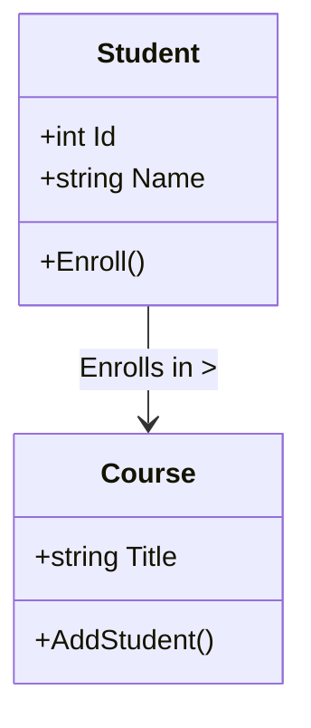

<div align="center">

# C# OOP Fundamentals Course 2026


*Ein umfassendes Portfolio für moderne Softwareentwicklung mit C# und .NET*

[Einrichtung](#-einrichtung-2026) • [Lerneinheiten](#-lerneinheiten-roadmap) • [Best Practices](#-best-practices--standards) • [Dokumentation](#-dokumentation--xml-kdocs)

</div>

---

## 🚀 Einrichtung 2026

Willkommen im Jahr 2026. Um dieses Repository optimal zu nutzen, benötigen Sie eine aktuelle Entwicklungsumgebung. Folgen Sie dieser Schritt-für-Schritt-Anleitung.

### 1. SDK Installation
Bevor Sie eine IDE installieren, stellen Sie sicher, dass das **.NET 10 SDK** installiert ist.
- Download: [dotnet.microsoft.com/download/dotnet/10.0](https://dotnet.microsoft.com/download/dotnet/10.0)
- Überprüfung im Terminal:
  ```powershell
  dotnet --version
  # Erwartete Ausgabe: 10.0.x
  ```

### 2. Entwicklungsumgebung (Wählen Sie eine)

<details>
<summary><strong>Option A: Visual Studio 2026 Community (Empfohlen)</strong></summary>

1.  Laden Sie den Visual Studio Installer herunter.
2.  Wählen Sie beim Installieren den Workload **".NET Desktop Development"**.
3.  Stellen Sie sicher, dass unter "Individual Classes" **Git for Windows** und **GitHub Extension** angehakt sind.
4.  Starten Sie Visual Studio und melden Sie sich mit Ihrem Microsoft-Konto an.
</details>

<details>
<summary><strong>Option B: JetBrains Rider 2026 (Education / Ultimate)</strong></summary>

1.  Installieren Sie Rider über die JetBrains Toolbox App.
2.  Beim ersten Start: Wählen Sie das **"C# Deep Dive"** Keymap Schema (optional, oder VS Standard).
3.  Konfigurieren Sie unter *Settings > Build, Execution, Deployment > Toolset and Build* das installierte .NET 10 SDK.
</details>

### 3. Essenzielle Plugins & Erweiterungen
Egal welche IDE Sie nutzen, diese Tools sind Pflicht für modernen Clean Code:

| Tool | Zweck | Installation |
| :--- | :--- | :--- |
| **GitHub Copilot Chat NEXT** | AI-Pair Programming | VS Installer / Rider Marketplace |
| **ReSharper 2026.1** | Code Analysis & Refactoring | (In Rider integriert) / VS Extension |
| **SonarLint** | Clean Code Linter | Marketplace Extension |
| **Roslyn Analyzers** | Statische Code-Analyse | (NuGet Paket im Projekt vorinstalliert) |

---

## 📚 Lerneinheiten (Roadmap)

Dieses Repository ist chronologisch und thematisch strukturiert. Jede Unit enthält Theorie, Praxisaufgaben und Lösungen.

| ID | Thema | Fokus | Status |
| :--- | :--- | :--- | :--- |
| **Phase 1** | **Foundation** | | |
| [01](./01_Intro) | **Einführung** | Setup, Hello World, Console | ✅ |
| [02](./02_Basics) | **Grundlagen** | Variablen, Datentypen, Operatoren | ✅ |
| [03](./03_ControlFlow) | **Kontrollstrukturen** | If, Switch, Loops | 🚧 |
| [04](./04_Methods) | **Methoden** | Parameter, Return, Call Stack | 🚧 |
| [05](./05_Strings) | **Strings & Memory** | Heap vs Stack, String Manipulation | 🚧 |
| **Phase 2** | **Object Oriented Programming** | | |
| [06](./06_Arrays) | **Arrays** | 1D Arrays, Iteration, Algorithmen | 🚧 |
| [07](./07_ArraysMulti) | **Multidimensionale Arrays** | 2D/3D Arrays, Matrix-Operationen | 🚧 |
| [08](./08_Procedures) | **Prozeduren** | Void Methoden, Side-Effects | 🚧 |
| [09](./09_Functions) | **Funktionen** | Return Values, Pure Functions | 🚧 |
| [10](./10_Classes) | **Klassen & Objekte** | Instanziierung, Kapselung | 🚧 |
| [11](./11_ValueReferences) | **Werte- vs. Referenztypen** | Copy by Value/Reference | 🚧 |
| [12](./12_Relationships) | **Beziehungen** | Assoziation, Aggregation, Komposition | 🚧 |
| [13](./13_Inheritance) | **Vererbung** | `base`, `virtual`, `override` | 🚧 |
| [14](./14_AbstractClasses) | **Abstrakte Klassen** | Abstraktion, Polymorphie | 🚧 |
| [15](./15_Interfaces) | **Interfaces** | Contracts, Dependency Injection | 🚧 |
| **Phase 3** | **Advanced C#** | | |
| [16](./16_StaticMembers) | **Static Members** | Singleton Pattern, Helpers | 🚧 |
| [17](./17_DelegatesEvents) | **Delegates & Events** | Observer Pattern, Lambdas | 🚧 |
| [18](./18_Algorithms) | **Algorithmen** | Sort, Search, Complexity (Big O) | 🚧 |
| [19](./19_Collections) | **Generic Collections** | List, Dictionary, HashSet | 🚧 |
| [20](./20_EventsExceptions) | **Exception Handling** | Try-Catch-Finally, Custom Exceptions | 🚧 |

---

## 🛠 Best Practices & Standards

Wir schreiben Code nicht nur, damit er funktioniert, sondern damit er **lebt, wartbar und schön** ist.

### C# 14 Features
Wir nutzen konsequent die neuesten Sprachfeatures:
- **Primary Constructors**: Weniger Boilerplate für Klassen.
- **Enhanced Collection Expressions**: `List<int> x = [1, 2, 3];`
- **Field Keywords**: Sauberere Properties.
- **Lambda Default Parameters**: Flexiblere Funktionszeiger.

### GitHub Workflow (GitFlow)
- **Main**: Nur stabiler, produktionsreifer Code.
- **Develop**: Integrations-Branch für neue Features.
- **Feature-Branches**: `feature/array-sorting`, `fix/typo-readme`.
- **Commit Messages**: [Conventional Commits](https://www.conventionalcommits.org/en/v1.0.0/) sind Pflicht!
  - `feat: add bubble sort implementation`
  - `docs: update xml comments for calculator`
  - `fix: resolve null reference exception`

### Methodik
- **TDD (Test Driven Development)**:
  1.  🔴 **Red**: Schreibe einen Test, der fehlschlägt.
  2.  🟢 **Green**: Implementiere minimalen Code, um den Test zu bestehen.
  3.  🔵 **Refactor**: Optimiere den Code ohne die Funktionalität zu ändern.
- **SFC (Separation of Concerns)**: Logik (Service), Daten (Model) und Anzeige (UI/Console) werden strikt getrennt.

---

## 📝 Dokumentation & XML KDocs

In diesem Repository gilt: **Wenn es nicht dokumentiert ist, existiert es nicht.**
Wir nutzen den **vollen Standard** von [Microsoft XML Documentation Comments](https://learn.microsoft.com/en-us/dotnet/csharp/language-reference/xmldoc/recommended-tags).

### Pflicht-Tags für jedes Member
```csharp
/// <summary>
/// Berechnet die Summe zweier Ganzzahlen und prüft auf Überlauf.
/// </summary>
/// <param name="a">Der erste Summand.</param>
/// <param name="b">Der zweite Summand.</param>
/// <returns>Das Ergebnis der Addition.</returns>
/// <exception cref="OverflowException">Wird geworfen, wenn das Ergebnis Int32.MaxValue überschreitet.</exception>
/// <example>
/// <code>
/// int result = Calculator.Add(5, 10);
/// Console.WriteLine(result); // 15
/// </code>
/// </example>
/// <remarks>
/// Diese Methode ist thread-safe implementiert.
/// </remarks>
public int Add(int a, int b) { ... }
```

---

## 🎨 UML Integration

Wir visualisieren Konzepte mit **MermaidJS**. Jede Unit enthält Diagramme aus den "Big 5":

1.  **Klassendiagramme**: Struktur und Beziehungen.
2.  **Sequenzdiagramme**: Zeitlicher Ablauf und Interaktion.
3.  **Aktivitätsdiagramme**: Programmfluss und Logik.
4.  **Zustandsdiagramme**: Statusübergänge von Objekten.
5.  **Anwendungsfalldiagramme (Use Case)**: Anforderungen und Akteure.



---

<div align="center">
    <sub>Built with ❤️ by Gemini Agent for .NET Developers</sub>
</div>
