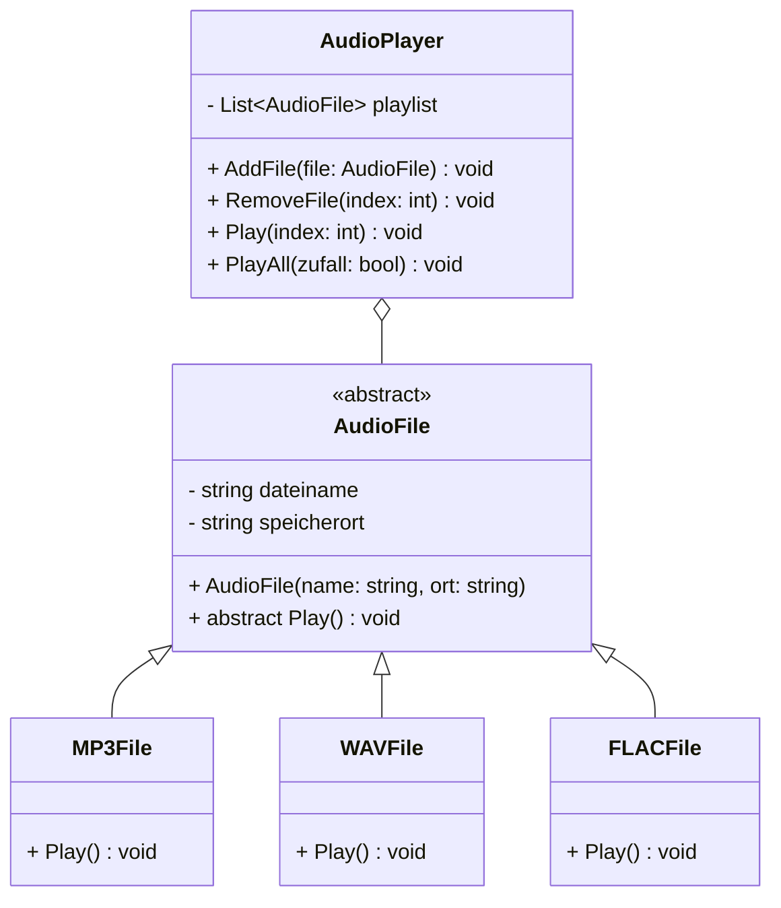

```mermaid
classDiagram
    class AudioFile {
        <<abstract>>
        - string dateiname
        - string speicherort
        + AudioFile(name: string, ort: string)
        + abstract Play() void
    }
    class MP3File { + Play() void }
    class WAVFile { + Play() void }
    class FLACFile { + Play() void }
    
    class AudioPlayer {
        - List~AudioFile~ playlist
        + AddFile(file: AudioFile) void
        + RemoveFile(index: int) void
        + Play(index: int) void
        + PlayAll(zufall: bool) void
    }

    AudioFile <|-- MP3File
    AudioFile <|-- WAVFile
    AudioFile <|-- FLACFile
    AudioPlayer o-- AudioFile
```
