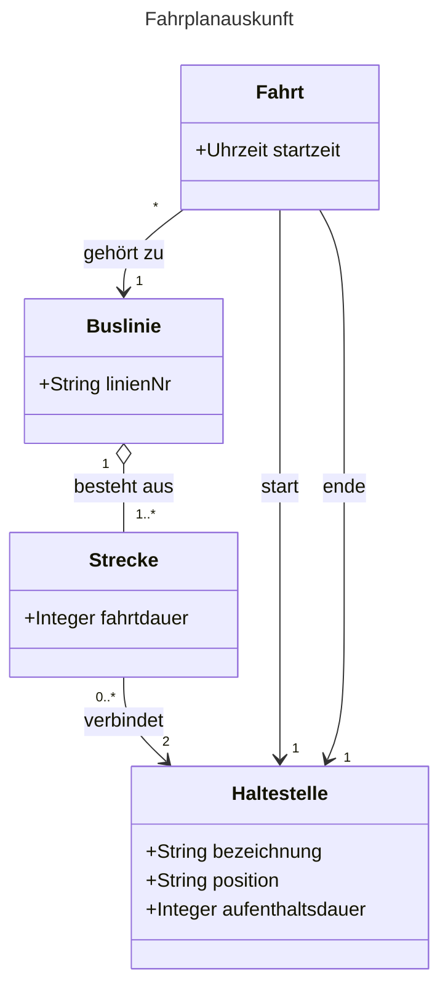

### Teil 2: Aufgabe 3a - Fahrplanauskunft

### Hinweise zum Diagramm (aus Aufgabe 3a)

* **Strecke zu Haltestelle:** Multiplizität `2`, da eine Strecke per Definition zwei Punkte verbindet.
* **Buslinie zu Strecke:** Aggregation (`o--`), da die Linie aus Strecken "zusammengesetzt" ist.
* **Fahrt zu Haltestelle:** Es gibt zwei Assoziationen, um Start und Ende abzubilden.

---

### Teil 3: Aufgabe 3b - KVAG / Personalverwaltung (Bild 2 unten)

**ba) Bedeutung der Aggregation (Hohle Raute)**
Es handelt sich um eine "Ganzes-Teile"-Beziehung, bei der die Teile (**Fahrer**) **nicht existenzabhängig** vom Ganzen (**Personalverwaltung**) sind.

> **Analogie:** Wie ein Fußballverein (Ganzes) und Spieler (Teile). Wenn der Verein aufgelöst wird, existieren die Spieler als Menschen weiter. Wird das Verwaltungsobjekt gelöscht, bleiben die Fahrer-Objekte in der Datenbank erhalten.

**bb) Bedeutung der Multiplizitäten**

* `1..*` **(bei Personalverwaltung -> Fahrer):** Eine Personalverwaltung muss **mindestens einen** (oder mehrere) Fahrer verwalten. Eine Verwaltung ohne Fahrer ist in diesem Modell nicht vorgesehen (leere Menge nicht erlaubt).
* `*` **(bei Fahrer -> Fahrzeugtyp):** Einem Fahrer können **beliebig viele** (0 bis unendlich) erlaubte Fahrzeugtypen zugeordnet sein. Ein neuer Fahrer darf also auch erst einmal gar keine Typen haben.

**bc) Komposition statt Aggregation?**
**Nein, eine Komposition ist hier nicht sinnvoll.**

* **Begründung:** Bei einer Komposition (gefüllte Raute) würde das Löschen der Personalverwaltung automatisch das Löschen aller Fahrer erzwingen (Existenzabhängigkeit). In der Realität ist ein Mitarbeiter (Fahrer) aber eine eigenständige Person. Nur weil z. B. eine Verwaltungsabteilung umstrukturiert oder gelöscht wird, darf der Datensatz des Menschen/Mitarbeiters nicht automatisch vernichtet werden.
