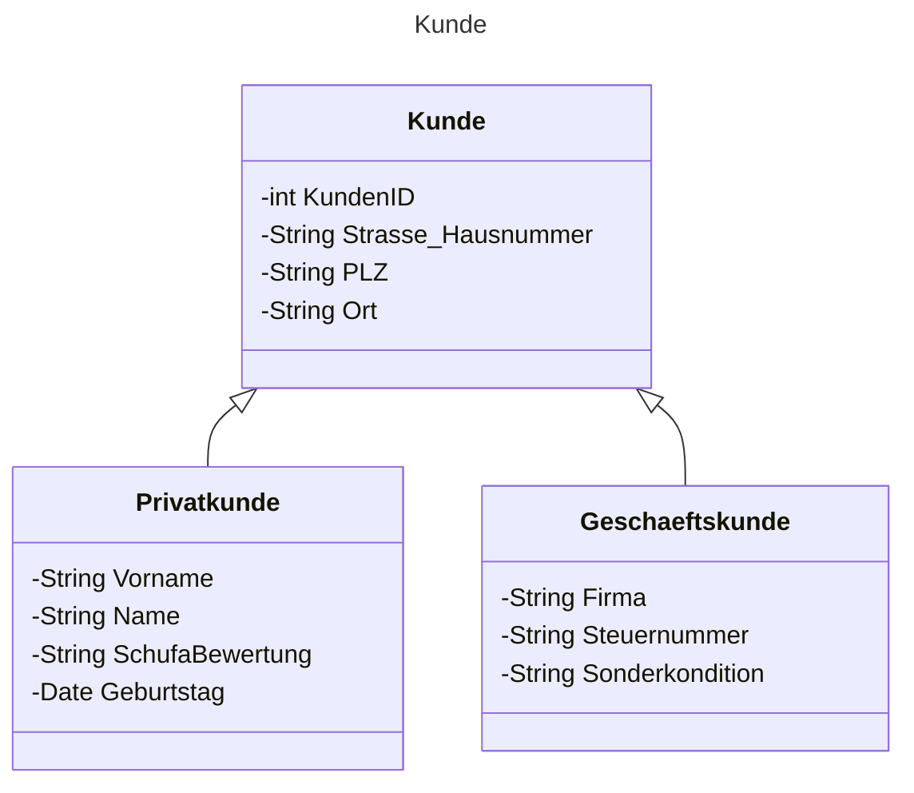

```mermaid
---
title: Kunde
---
classDiagram
    %% Oberklasse
    class Kunde {
        -int KundenID
        -String Strasse_Hausnummer
        -String PLZ
        -String Ort
    }

    %% Unterklasse Privatkunde
    class Privatkunde {
        -String Vorname
        -String Name
        -String SchufaBewertung
        -Date Geburtstag
    }

    %% Unterklasse Geschäftskunde
    class Geschaeftskunde {
        -String Firma
        -String Steuernummer
        -String Sonderkondition
    }

    %% Vererbung
    Kunde <|-- Privatkunde
    Kunde <|-- Geschaeftskunde
```
